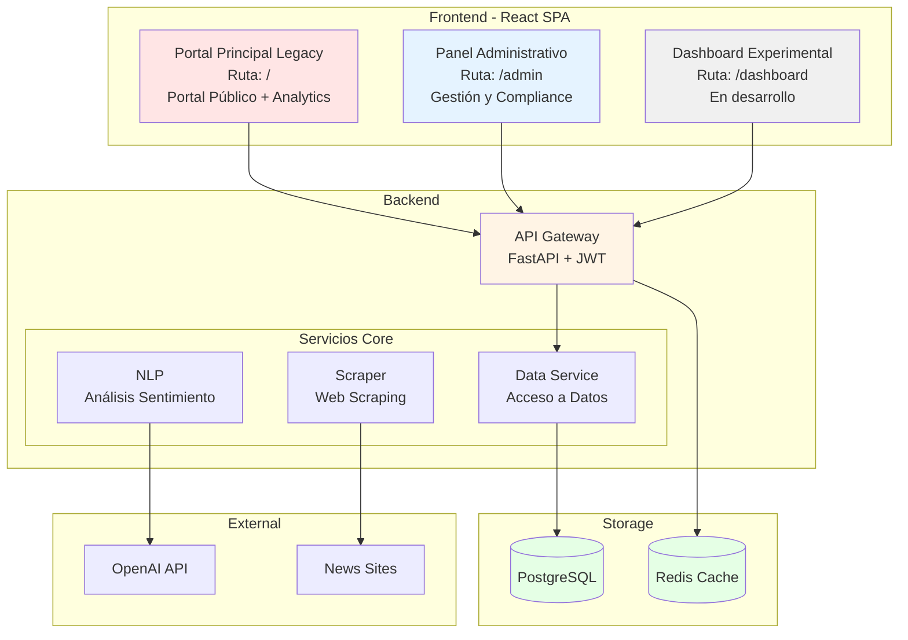
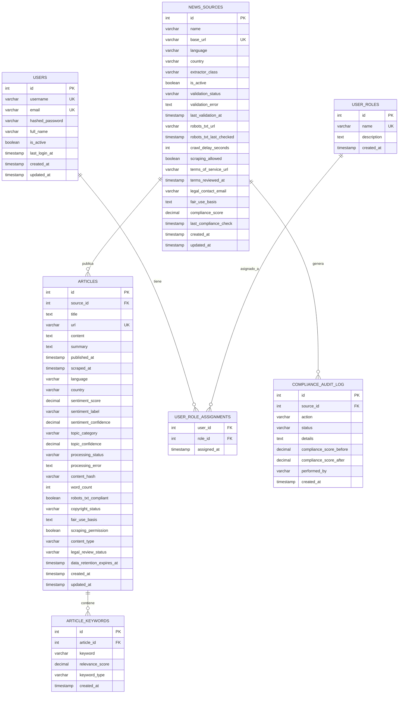

# Especificación de Requerimientos del Software (ERS)
## Sistema PreventIA News Analytics

**Versión:** 1.0
**Fecha:** 29 de Julio de 2025
**Estado:** FINAL
**Proyecto de Investigación:** PreventIA - Detección temprana de Cáncer de mama
**Institución:** Fundación Universitaria Compensar, Colombia

---

## Tabla de Contenidos

1. [Introducción](#1-introducción)
   1.1 [Propósito](#11-propósito)
   1.2 [Alcance](#12-alcance)
   1.3 [Definiciones, Acrónimos y Abreviaturas](#13-definiciones-acrónimos-y-abreviaturas)
   1.4 [Referencias](#14-referencias)
   1.5 [Visión General del Documento](#15-visión-general-del-documento)

2. [Descripción General del Sistema](#2-descripción-general-del-sistema)
   2.1 [Perspectiva del Producto](#21-perspectiva-del-producto)
   2.2 [Funciones del Producto](#22-funciones-del-producto)
   2.3 [Características de los Usuarios](#23-características-de-los-usuarios)
   2.4 [Restricciones](#24-restricciones)
   2.5 [Suposiciones y Dependencias](#25-suposiciones-y-dependencias)

3. [Requerimientos Funcionales](#3-requerimientos-funcionales)
   3.1 [Gestión de Fuentes de Noticias](#31-gestión-de-fuentes-de-noticias)
   3.2 [Web Scraping Automatizado](#32-web-scraping-automatizado)
   3.3 [Análisis de Sentimiento y NLP](#33-análisis-de-sentimiento-y-nlp)
   3.4 [Dashboard de Visualización](#34-dashboard-de-visualización)
   3.5 [Sistema de Exportación](#35-sistema-de-exportación)
   3.6 [Gestión de Usuarios y Autenticación](#36-gestión-de-usuarios-y-autenticación)
   3.7 [CLI de Administración](#37-cli-de-administración)

4. [Requerimientos No Funcionales](#4-requerimientos-no-funcionales)
   4.1 [Requisitos de Rendimiento](#41-requisitos-de-rendimiento)
   4.2 [Requisitos de Seguridad](#42-requisitos-de-seguridad)
   4.3 [Requisitos de Fiabilidad](#43-requisitos-de-fiabilidad)
   4.4 [Requisitos de Mantenibilidad](#44-requisitos-de-mantenibilidad)
   4.5 [Requisitos de Portabilidad](#45-requisitos-de-portabilidad)

5. [Requerimientos de Interfaz](#5-requerimientos-de-interfaz)
   5.1 [Interfaces de Usuario](#51-interfaces-de-usuario)
   5.2 [Interfaces de Hardware](#52-interfaces-de-hardware)
   5.3 [Interfaces de Software](#53-interfaces-de-software)
   5.4 [Interfaces de Comunicación](#54-interfaces-de-comunicación)

6. [Apéndices](#6-apéndices)
   6.1 [Arquitectura del Sistema](#61-arquitectura-del-sistema)
   6.2 [Modelo de Datos](#62-modelo-de-datos)
   6.3 [Stack Tecnológico](#63-stack-tecnológico)

---

## 1. Introducción

### 1.1 Propósito

Este documento establece la especificación completa de requerimientos del software para el sistema **PreventIA News Analytics**, una plataforma inteligente de monitoreo y análisis de noticias especializada en el análisis automatizado de información relacionada con el cáncer de mama. Este sistema forma parte del proyecto de investigación multidisciplinario PreventIA, desarrollado en el marco del programa de Investigación y Desarrollo de la Fundación Universitaria Compensar en Colombia.

El propósito principal de este documento es:
- Definir las funcionalidades completas del sistema de análisis de narrativas mediáticas sobre cáncer de mama
- Establecer los requerimientos funcionales y no funcionales para el "Radar de Narrativas Médicas"
- Servir como referencia para el desarrollo, mantenimiento y evolución del sistema
- Facilitar la comunicación entre investigadores, desarrolladores y stakeholders del proyecto PreventIA
- Documentar el cumplimiento de aspectos éticos y legales en el tratamiento de información mediática

### 1.2 Alcance

PreventIA News Analytics es una plataforma integral que combina un portal informativo público sobre prevención del cáncer de mama con un sistema automatizado de análisis de noticias, diseñado específicamente para apoyar tanto a la comunidad general como a investigadores en el contexto colombiano.

**Incluye:**
- Portal web público con información educativa sobre prevención y detección temprana del cáncer de mama
- Directorio de instituciones de apoyo y recursos en Colombia
- Web scraping automatizado de fuentes de noticias médicas colombianas e internacionales
- Análisis de sentimiento mediante procesamiento de lenguaje natural (NLP) en español e inglés
- Clasificación temática de artículos según categorías médicas relevantes
- Dashboard interactivo para visualización de analytics y tendencias mediáticas (con autenticación)
- Sistema de exportación multi-formato (CSV, Excel, PDF) para investigadores
- Panel de administración para gestión de fuentes de noticias
- CLI para administración y automatización del sistema
- Análisis estadístico de patrones discursivos y sesgos en la cobertura mediática

**No incluye:**
- Diagnóstico médico automatizado o asistencia clínica directa
- Recomendaciones de tratamiento o consejos médicos
- Almacenamiento o procesamiento de historiales clínicos de pacientes
- Integración directa con sistemas hospitalarios o de salud
- Generación automática de resúmenes de noticias (por restricciones de derechos de autor)
- Análisis de imágenes médicas o mamografías

### 1.3 Definiciones, Acrónimos y Abreviaturas

#### Términos Técnicos

- **API (Application Programming Interface)**: Interfaz de programación de aplicaciones que permite la comunicación entre diferentes componentes de software mediante un conjunto definido de protocolos y herramientas.

- **CLI (Command Line Interface)**: Interfaz de línea de comandos que permite a los usuarios interactuar con el sistema mediante comandos de texto, utilizada principalmente para tareas administrativas y automatización.

- **CRUD (Create, Read, Update, Delete)**: Conjunto de operaciones básicas de gestión de datos que permiten crear, leer, actualizar y eliminar registros en una base de datos.

- **JWT (JSON Web Token)**: Estándar abierto (RFC 7519) que define una forma compacta y autónoma de transmitir información de forma segura entre partes como un objeto JSON, utilizado para autenticación en el sistema.

- **NLP (Natural Language Processing)**: Procesamiento de Lenguaje Natural, rama de la inteligencia artificial que permite a las computadoras comprender, interpretar y generar lenguaje humano de manera útil.

- **ORM (Object-Relational Mapping)**: Técnica de programación que permite convertir datos entre sistemas incompatibles utilizando lenguajes de programación orientados a objetos, facilitando el acceso a bases de datos relacionales.

- **REST (Representational State Transfer)**: Estilo arquitectónico para el desarrollo de servicios web que utiliza el protocolo HTTP para operaciones CRUD sobre recursos identificados por URLs.

- **SPA (Single Page Application)**: Aplicación web que carga una sola página HTML y actualiza dinámicamente el contenido según la interacción del usuario, mejorando la experiencia de usuario.

#### Términos Específicos del Sistema

- **VADER (Valence Aware Dictionary and sEntiment Reasoner)**: Herramienta de análisis de sentimiento basada en reglas y léxico, especialmente efectiva para textos de redes sociales y noticias, utilizada en el módulo NLP del sistema.

- **Web Scraping**: Técnica automatizada de extracción de datos de sitios web mediante programas que simulan la navegación humana, respetando las políticas de robots.txt y términos de servicio.

- **Compliance Score**: Puntuación numérica (0.00 a 1.00) que indica el nivel de cumplimiento legal de una fuente de noticias, considerando factores como robots.txt, términos de servicio y derechos de autor.

- **Crawl Delay**: Tiempo mínimo de espera entre solicitudes consecutivas a un sitio web durante el proceso de scraping, especificado en robots.txt para evitar sobrecarga del servidor.

#### Términos del Dominio Médico

- **Cáncer de Mama**: Tipo de cáncer que se forma en las células de las mamas, foco principal del análisis de noticias del sistema PreventIA.

- **Detección Temprana**: Identificación del cáncer en sus etapas iniciales cuando es más tratable, objetivo principal del proyecto PreventIA.

- **Tamizaje**: Proceso de evaluación sistemática para detectar enfermedades en personas asintomáticas, incluye mamografías y autoexámenes.

### 1.4 Referencias

- Estándar IEEE 830-1998 para Especificación de Requerimientos de Software
- Documentación de FastAPI v0.115.14
- Documentación de React v19.1.0
- Documentación de PostgreSQL v13+
- Principios de Fair Use y robots.txt

### 1.5 Visión General del Documento

Este documento está estructurado siguiendo el estándar IEEE 830, organizado en secciones que cubren desde la descripción general del sistema hasta los requerimientos específicos funcionales y no funcionales, concluyendo con apéndices técnicos detallados.

---

## 2. Descripción General del Sistema

### 2.1 Perspectiva del Producto

PreventIA News Analytics es un sistema autónomo diseñado para operar como una plataforma independiente de monitoreo de medios especializados. El sistema se integra con:

- **Fuentes de datos externas**: Sitios web de noticias médicas mediante web scraping
- **Servicios de IA**: OpenAI API para procesamiento avanzado de texto 
- **Infraestructura de contenedores**: Docker para despliegue y escalabilidad

**Arquitectura del Sistema:**
El sistema PreventIA News Analytics sigue una arquitectura de microservicios simplificada que separa las responsabilidades en capas bien definidas. La capa de presentación consiste en una aplicación React SPA que ofrece tres interfaces principales: un portal público informativo sobre prevención del cáncer de mama, un dashboard de analytics para investigadores, y un panel administrativo. Todas las interfaces se comunican con el backend a través de un API Gateway centralizado basado en FastAPI que maneja la autenticación JWT y enruta las peticiones a los servicios apropiados.

El backend está compuesto por servicios especializados que incluyen el servicio de web scraping para recolectar noticias, el servicio NLP para análisis de sentimiento y clasificación, y un servicio de datos que gestiona el acceso a la base de datos PostgreSQL. La arquitectura utiliza Redis como caché para optimizar el rendimiento, y se integra con servicios externos como OpenAI API para procesamiento avanzado de texto y los sitios web de noticias como fuentes de información.

### 2.2 Funciones del Producto

Las funciones principales del sistema incluyen:

1. **Portal Informativo Público**
   - Contenido educativo sobre prevención del cáncer de mama
   - Guías de autoexamen y detección temprana
   - Directorio de instituciones de apoyo en Colombia
   - Información del proyecto PreventIA

2. **Monitoreo Automatizado de Noticias**
   - Recopilación automática de artículos de fuentes configuradas
   - Detección de duplicados y contenido relevante
   - Respeto de políticas de robots.txt y términos de servicio

3. **Análisis Inteligente de Contenido**
   - Análisis de sentimiento (positivo, neutral, negativo)
   - Clasificación temática (prevención, tratamiento, investigación, etc.)
   - Extracción de palabras clave y entidades

4. **Visualización y Analytics**
   - Dashboard en tiempo real con métricas agregadas
   - Gráficos de tendencias temporales
   - Integración de datos relevantes en el portal público

5. **Gestión y Administración**
   - Panel de administración para gestión de fuentes
   - Sistema de compliance y validación legal
   - Herramientas CLI para operaciones avanzadas

### 2.3 Características de los Usuarios

El sistema está diseñado para atender a los siguientes perfiles de usuarios, en el contexto del proyecto de investigación PreventIA:

**Investigadores del Proyecto PreventIA:**
- Perfil: Investigadores multidisciplinarios de la Fundación Universitaria Compensar
- Necesidades: Análisis de tendencias mediáticas, exportación de datos para publicaciones, identificación de patrones discursivos
- Nivel técnico: Medio-alto
- Frecuencia de uso: Semanal/mensual

**Profesionales de la Salud:**
- Perfil: Médicos y personal sanitario de hospitales de primer y segundo nivel en municipios de 5ta y 6ta categoría
- Necesidades: Información actualizada sobre comunicación del cáncer de mama, tendencias en la cobertura mediática
- Nivel técnico: Básico-medio
- Frecuencia de uso: Consulta ocasional

**Administradores del Sistema:**
- Perfil: Personal técnico del equipo de desarrollo PreventIA
- Necesidades: Gestión completa del sistema, mantenimiento, configuración de fuentes
- Nivel técnico: Alto
- Frecuencia de uso: Diaria

**Tomadores de Decisiones en Salud Pública:**
- Perfil: Funcionarios y gestores de política pública en salud
- Necesidades: Reportes ejecutivos, análisis de impacto mediático, métricas agregadas
- Nivel técnico: Básico
- Frecuencia de uso: Mensual
**Comunidad General:**
- Perfil: Público interesado en la prevención del cáncer de mama
- Necesidades: Acceso a información confiable, comprensión de tendencias mediáticas
- Nivel técnico: Básico
- Frecuencia de uso: Ocasional

### 2.4 Restricciones

1. **Restricciones Técnicas:**
   - Python 3.13+ requerido para el backend
   - Node.js 18+ para el frontend
   - PostgreSQL 13+ como base de datos principal
   - Contenedores Docker para despliegue

2. **Restricciones Legales y Éticas:**
   - Cumplimiento estricto con políticas de robots.txt
   - Respeto de términos de servicio de todas las fuentes
   - Aplicación de principios de Fair Use en el manejo de contenido
   - Protección de datos personales según regulaciones colombianas
   - Prohibición absoluta de generar resúmenes automáticos de noticias (derechos de autor)
   - Manejo ético de información sensible sobre salud

3. **Restricciones de Diseño:**
   - Arquitectura de microservicios para modularidad
   - API RESTful para comunicación entre componentes
   - Interfaz responsive para múltiples dispositivos
   - Diseño centrado en la usabilidad para personal médico con conocimientos técnicos básicos

4. **Restricciones del Contexto de Investigación:**
   - Prioridad en el análisis estadístico sobre la generación de contenido
   - Alineación con los objetivos del proyecto PreventIA

### 2.5 Suposiciones y Dependencias

**Suposiciones:**
- Disponibilidad continua de las fuentes de noticias externas
- Acceso estable a Internet para web scraping
- Disponibilidad de OpenAI API para procesamiento avanzado

**Dependencias:**
- Beautiful Soup y Playwright para web scraping
- Spacy y VADER para análisis de sentimiento
- FastAPI para el servidor de API
- React para la interfaz de usuario
- PostgreSQL para almacenamiento de datos

---

## 3. Requerimientos Funcionales

### 3.1 Gestión de Fuentes de Noticias

**RF-3.1.1** El sistema debe permitir crear nuevas fuentes de noticias con los siguientes campos obligatorios:
- Nombre de la fuente
- URL base
- País
- Idioma
- Email de contacto legal

**RF-3.1.2** El sistema debe validar automáticamente el cumplimiento legal de cada fuente mediante los siguientes criterios específicos:
- Verificación de robots.txt accessibility y permisos de scraping
- Verificación de información de contacto legal disponible
- Análisis de términos de servicio para restricciones automatizadas
- Documentación de base de uso justo (fair use) para investigación académica
- Aplicación de principios de minimización de datos
- Validación de crawl delay mínimo de 2 segundos
- Cálculo de score de compliance (0.00 a 1.00) basado en criterios objetivos

**RF-3.1.3** El sistema debe rechazar automáticamente fuentes que no cumplan con los criterios mínimos:
- Crawl delay menor a 2 segundos
- Ausencia de robots.txt URL
- Falta de información de contacto legal
- Ausencia de URL de términos de servicio
- Falta de documentación de base de uso justo

**RF-3.1.4** El sistema debe permitir operaciones CRUD completas sobre fuentes existentes

**RF-3.1.5** El sistema debe mantener un registro de auditoría de todos los cambios en fuentes

**RF-3.1.6** El sistema debe implementar re-evaluación automática mensual de compliance:
- Verificación programada de robots.txt cada 30 días
- Validación periódica de términos de servicio
- Re-cálculo de compliance score mensualmente
- Notificación automática de cambios en el estado de compliance
- Desactivación automática de fuentes que fallen la re-evaluación

### 3.2 Web Scraping Automatizado

**RF-3.2.1** El sistema debe generar automáticamente scrapers específicos para cada fuente basándose en:
- Detección del CMS (WordPress, Drupal, etc.)
- Análisis de la estructura HTML
- Patrones de contenido médico

**RF-3.2.2** El sistema debe respetar el crawl delay especificado en robots.txt (mínimo 2 segundos)

**RF-3.2.3** El sistema debe extraer de cada artículo:
- Título
- Contenido (respetando limitaciones de copyright)
- Fecha de publicación
- URL original
- Metadatos relevantes

**RF-3.2.4** El sistema debe detectar y evitar contenido duplicado mediante hash de contenido

**RF-3.2.5** El sistema debe ejecutar scrapers de forma programada o bajo demanda

### 3.3 Análisis de Sentimiento y NLP

**RF-3.3.1** El sistema debe analizar el sentimiento de cada artículo mediante VADER optimizado para contenido médico, generando:
- Score compuesto (-1.000 a 1.000) calculado por VADER
- Etiqueta categórica con thresholds específicos para contenido médico:
  - Positivo: compound ≥ 0.3 (confianza = |compound|) o compound ≥ 0.1 (confianza = |compound| × 0.7)
  - Negativo: compound ≤ -0.3 (confianza = |compound|) o compound ≤ -0.1 (confianza = |compound| × 0.7)
  - Neutral: -0.1 < compound < 0.1 (confianza = 1 - |compound|)
- Scores detallados: positivo, negativo, neutral de VADER
- Metadatos: longitud de texto original y procesado

**RF-3.3.2** El sistema debe clasificar artículos en categorías temáticas:
- Prevención
- Tratamiento
- Diagnóstico
- Testimonios
- Investigación
- Ensayos clínicos
- Otros

**RF-3.3.3** El sistema debe extraer palabras clave relevantes con sus tipos:
- Términos médicos
- Medicamentos
- Procedimientos
- Organizaciones
- Personas
- Ubicaciones

**RF-3.3.4** El sistema debe soportar análisis en español e inglés

**RF-3.3.5** El sistema debe aplicar criterios de calidad de datos para análisis NLP válido:
- Longitud mínima de título: 10 caracteres (configurable: SCRAPER_MIN_TITLE_LENGTH)
- Longitud mínima de resumen: 20 caracteres (configurable: SCRAPER_MIN_SUMMARY_LENGTH)
- Requisito de resumen: obligatorio (configurable: SCRAPER_REQUIRE_SUMMARY=True)
- Longitud mínima de contenido completo: 0 caracteres (permite el procesamiento de artículos que solo tienen título y resumen, sin contenido corporal extenso, útil para noticias breves o alertas)
- Validación de word_count para métricas de calidad del análisis
- Preservación de text_length y processed_text_length para auditoría y métricas

**RF-3.3.6** El sistema debe manejar errores de análisis NLP mediante:
- Fallback a valores neutrales cuando el análisis falla (sentiment_label: "neutral", confidence: 0.0)
- Preservación de metadatos de error para debugging
- Continuación del procesamiento de otros artículos en caso de fallo individual
- Logging estructurado de errores para monitoreo del sistema

### 3.4 Dashboard de Visualización y Portal Informativo

**RF-3.4.1** El sistema debe proporcionar una plataforma web unificada con dos interfaces principales:

**A) Portal Principal Legacy (Ruta: `/`):**
- Portal público informativo con información del proyecto PreventIA
- Sección educativa sobre el cáncer de mama
- Guías de prevención y autoexamen
- Dashboard de analytics integrado con tema rosa-azul médico
- Estadísticas y tendencias mediáticas
- Herramientas de exportación de datos
- Acceso sin autenticación para datos públicos

**B) Panel de Administración (Ruta: `/admin`):**
- Gestión completa de fuentes de noticias con operaciones CRUD
- Monitoreo de compliance en tiempo real
- Dashboard de estadísticas de compliance
- Administración de usuarios y roles
- Acceso restringido con autenticación JWT

**RF-3.4.2** El portal público debe mostrar:
- Contenido educativo estático sobre prevención del cáncer de mama
- Datos relevantes del análisis de noticias (sin requerir login)
- Información actualizada sobre el proyecto PreventIA

**RF-3.4.3** El dashboard de analytics debe mostrar:
- Total de artículos procesados
- Distribución de sentimientos
- Tendencias temporales
- Top de palabras clave
- Filtros por fecha, fuente, sentimiento y categoría

**RF-3.4.4** Toda la plataforma debe ser responsive y funcionar como SPA

### 3.5 Sistema de Exportación

**RF-3.5.1** El sistema debe exportar datos en formato CSV con todos los campos de artículos

**RF-3.5.2** El sistema debe exportar en Excel con múltiples hojas:
- Resumen ejecutivo
- Listado de artículos
- Análisis de sentimientos
- Palabras clave

**RF-3.5.3** El sistema debe generar reportes PDF con:
- Gráficos de visualización
- Tablas de datos
- Resumen estadístico

**RF-3.5.4** El sistema debe exportar gráficos como imágenes PNG

**RF-3.5.5** Las exportaciones deben respetar los filtros aplicados en el dashboard

### 3.6 Gestión de Usuarios y Autenticación

**RF-3.6.1** El sistema debe implementar autenticación basada en JWT

**RF-3.6.2** El sistema debe soportar los siguientes roles:
- Administrador (acceso total)
- Analista (lectura y exportación)
- Demo (acceso limitado)

**RF-3.6.3** El sistema debe crear automáticamente un usuario administrador en la primera ejecución

**RF-3.6.4** El sistema debe permitir gestión CRUD de usuarios solo a administradores

**RF-3.6.5** Los tokens JWT deben expirar después de 24 horas

### 3.7 CLI de Administración

**RF-3.7.1** El CLI debe proporcionar comandos para:
- Gestión de fuentes
- Ejecución de scrapers
- Gestión de usuarios
- Monitoreo de compliance
- Verificación de estado del sistema

**RF-3.7.2** El CLI debe soportar operaciones batch para procesamiento masivo

**RF-3.7.3** El CLI debe proporcionar salida formateada y códigos de retorno estándar

---

## 4. Requerimientos No Funcionales

### 4.1 Requisitos de Rendimiento

**RNF-4.1.1** El sistema debe procesar al menos 50 artículos por minuto considerando las limitaciones de crawl delay

**RNF-4.1.2** El dashboard debe cargar en menos de 3 segundos incluso en conexiones de baja velocidad de 1 Mbps (velocidad práctica mínima en municipios de 5ta y 6ta categoría en Colombia)

**RNF-4.1.3** Las consultas a la API deben responder en menos de 2 segundos para operaciones de lectura

**RNF-4.1.4** El sistema debe soportar al menos 20 usuarios humanos concurrentes utilizando el dashboard web simultáneamente (no incluye procesos automáticos de scraping que operan independientemente)

**RNF-4.1.5** El análisis NLP debe completarse en menos de 5 segundos por artículo

**RNF-4.1.6** El sistema debe procesar el pipeline completo diario en menos de 4 horas

**RNF-4.1.7** Las exportaciones de datos deben generarse en menos de 30 segundos para datasets de hasta 10,000 artículos

### 4.2 Requisitos de Seguridad

**RNF-4.2.1** Todas las contraseñas deben almacenarse con hash bcrypt

**RNF-4.2.2** La comunicación API debe usar HTTPS en producción

**RNF-4.2.3** El sistema debe validar y sanitizar todas las entradas de usuario

**RNF-4.2.4** Los logs no deben contener información sensible

**RNF-4.2.5** El sistema debe implementar rate limiting en endpoints públicos

### 4.3 Requisitos de Fiabilidad

**RNF-4.3.1** El sistema debe tener una disponibilidad mínima del 95% durante horario de investigación (8:00 AM - 6:00 PM hora Colombia), medida como:
- Uptime del servidor ≥ 95% del tiempo
- Tiempo de respuesta de API ≤ 5 segundos para el 95% de las peticiones
- Métrica combinada: (tiempo_operativo × respuestas_exitosas_bajo_5s) / tiempo_total ≥ 0.95

**RNF-4.3.2** El sistema debe recuperarse automáticamente de fallos de scraping sin pérdida de datos

**RNF-4.3.3** Los datos deben respaldarse diariamente con retención de 30 días

**RNF-4.3.4** El sistema debe implementar política de retención ultra-conservadora priorizando seguridad legal:

**Datos Permanentes (para análisis longitudinal):**
- Metadatos no-protegidos: fecha_publicación, fuente_id, país, idioma
- Analytics calculados: sentiment_score, sentiment_label, topic_category
- Estadísticas agregadas: word_count, confidence_scores
- Keywords extraídas mediante NLP
- Hash del contenido original (para detectar duplicados sin almacenar contenido)

**Datos Temporales (eliminación automática):**
- Logs de compliance: 90 días
- Logs de auditoría del sistema: 90 días  
- Datos de debugging: 30 días
- Contenido original (títulos, resúmenes): NO SE ALMACENA tras procesamiento

**Restricciones de Privacidad:**
- No se almacenan títulos completos ni resúmenes tras el análisis NLP
- Fair Use ultra-conservador: solo procesamiento transitorio para análisis académico
- Principio de minimización: extracción de solo metadatos esenciales para investigación
- URLs de referencia se mantienen solo como fuente_id para anonimización
- Datos personales identificables: eliminación inmediata

**RNF-4.3.5** El sistema debe continuar funcionando aunque fallen fuentes individuales de noticias

**RNF-4.3.6** Las ventanas de mantenimiento deben programarse fuera del horario de investigación (fines de semana preferiblemente)

### 4.4 Requisitos de Mantenibilidad

**RNF-4.4.1** El código debe mantener una cobertura de tests mínima del 85%

**RNF-4.4.2** El código debe seguir los estándares PEP8 (Python) y ESLint (JavaScript)

**RNF-4.4.3** Toda la API debe estar documentada con OpenAPI/Swagger

**RNF-4.4.4** Los componentes deben estar desacoplados mediante interfaces

### 4.5 Requisitos de Portabilidad

**RNF-4.5.1** El sistema debe ser desplegable mediante Docker

**RNF-4.5.2** El sistema debe funcionar en Linux, macOS y Windows (mediante Docker)

**RNF-4.5.3** La base de datos debe ser portable mediante dumps SQL estándar

**RNF-4.5.4** El frontend debe ser compatible con navegadores modernos (Chrome, Firefox, Safari, Edge)

---

## 5. Requerimientos de Interfaz

### 5.1 Interfaces de Usuario

**RI-5.1.1** Dashboard Principal (Legacy)
- Tema rosa-azul médico
- Diseño responsive con breakpoints en 768px y 1024px
- Navegación mediante tabs
- Gráficos interactivos con Recharts
- Idioma: Español

**RI-5.1.2** Panel de Administración
- Acceso mediante /admin
- Tablas con paginación y búsqueda
- Formularios modales para CRUD
- Validación en tiempo real
- Confirmación para acciones destructivas

**RI-5.1.3** Dashboard Moderno (Futuro)
- Diseño profesional médico
- Componentes accesibles (WCAG 2.1)
- Tema claro/oscuro
- Internacionalización preparada

### 5.2 Interfaces de Hardware

**RI-5.2.1** Servidor de Aplicación
- Mínimo 4 CPU cores
- Mínimo 8GB RAM
- 50GB almacenamiento SSD
- Conexión de red estable

**RI-5.2.2** Cliente
- Cualquier dispositivo con navegador web moderno
- Resolución mínima 1024x768
- Conexión a Internet

### 5.3 Interfaces de Software

**RI-5.3.1** Base de Datos
- PostgreSQL 13+ con extensión asyncpg
- Conexión mediante SQLAlchemy ORM

**RI-5.3.2** Cache
- Redis 5.2+ para caché de sesiones y resultados

**RI-5.3.3** Servicios Externos
- OpenAI API para procesamiento avanzado de texto
- Servicios de noticias mediante HTTP/HTTPS

**RI-5.3.4** Contenedores
- Docker 20+ y Docker Compose 2.0+

### 5.4 Interfaces de Comunicación

**RI-5.4.1** API REST
- Protocolo HTTP/HTTPS
- Formato JSON para request/response
- Autenticación mediante Bearer token (JWT)
- Versionado de API (/api/v1/)

**RI-5.4.2** WebSockets (Futuro)
- Para actualizaciones en tiempo real del dashboard

**RI-5.4.3** CLI
- Interfaz de línea de comandos con salida formateada
- Soporte para pipes y redirección estándar Unix

---

## 6. Apéndices

### 6.1 Arquitectura del Sistema

El sistema sigue una arquitectura de microservicios con los siguientes componentes:

1. **Frontend Layer**
   - React SPA con TypeScript
   - Vite como bundler
   - TanStack Query para estado del servidor
   - Tailwind CSS para estilos

2. **API Gateway**
   - FastAPI como framework principal
   - Middleware CORS configurado
   - Rate limiting y validación

3. **Microservicios**
   - **Scraper Service**: Web scraping con BeautifulSoup y Playwright
   - **NLP Service**: Análisis con Spacy y VADER
   - **Data Service**: Capa de acceso a datos con SQLAlchemy
   - **Analytics Service**: Agregación y cálculo de métricas
   - **Decision Engine**: Lógica de negocio y reglas
   - **Orchestrator**: Coordinación de pipeline
   - **Publisher**: Publicación de resultados en wordpress (legacy)
   - **Copywriter**: Generación de contenido

4. **Data Layer**
   - PostgreSQL para persistencia principal
   - Redis para caché y sesiones

### 6.2 Modelo de Datos

El modelo de datos del sistema está diseñado para soportar tanto el análisis de noticias como la gestión de usuarios y el cumplimiento legal. Las principales entidades se relacionan de manera que permiten trazabilidad completa desde las fuentes de noticias hasta los análisis realizados.

**Notas sobre el modelo:**

- **news_sources**: Almacena las fuentes de noticias con extensos campos de compliance legal
- **articles**: Contiene los artículos procesados con análisis de sentimiento y categorización
- **article_keywords**: Palabras clave extraídas con su relevancia y tipo
- **users**: Usuarios del sistema con autenticación segura
- **user_roles**: Roles disponibles (Admin, Analista, Demo)
- **user_role_assignments**: Relación muchos a muchos entre usuarios y roles
- **compliance_audit_log**: Registro de auditoría para cumplimiento legal

### 6.3 Stack Tecnológico

**Backend:**
- Python 3.13 (exacto, especificado en settings.py)
- FastAPI 0.115.14 (especificado en requirements.txt)
- SQLAlchemy 2.0+ con extensión asyncpg
- Spacy 3.8+ con modelo en_core_web_sm
- VaderSentiment 3.3.2
- Beautiful Soup 4.13+
- Playwright 1.51+ para scraping avanzado
- Pydantic Settings para configuración unificada

**Frontend:**
- React 19+ con TypeScript 5.8+
- Vite como bundler principal
- TanStack Query para estado del servidor
- Tailwind CSS para estilos responsivos
- Recharts para visualizaciones médicas
- React Router para enrutamiento SPA

**Infraestructura:**
- Docker & Docker Compose
- PostgreSQL 13+
- Redis 5.2+
- Nginx (producción)

**Herramientas:**
- pytest (testing Python)
- Vitest (testing JavaScript)
- Black & isort (formateo Python)
- ESLint (linting JavaScript)
- Pre-commit hooks

---

## 7. Consideraciones Éticas y de Investigación

### 7.1 Principios Éticos

El sistema se desarrolla bajo los siguientes principios éticos del proyecto PreventIA:

- **Transparencia**: Toda fuente de información es claramente identificada y atribuida
- **Veracidad**: No se genera contenido artificial sobre noticias, solo análisis estadístico
- **Responsabilidad**: El sistema no proporciona consejos médicos ni diagnósticos

### 7.2 Cumplimiento con la Investigación

- El sistema debe generar datos auditables para publicaciones académicas
- Los resultados deben ser reproducibles para validación científica
- La metodología de análisis debe estar documentada y ser transparente
- Los datos deben preservarse según estándares de investigación académica

### 7.3 Impacto Social

- El sistema busca democratizar el acceso a información sobre cáncer de mama
- Contribuye a identificar brechas en la comunicación de salud pública
- Apoya la toma de decisiones basada en evidencia en políticas de salud

---

## 8. Evolución Futura del Sistema

### 8.1 Radar de Narrativas Médicas

El sistema evolucionará hacia una plataforma más completa de análisis de narrativas:

- Visualización avanzada de patrones discursivos
- Identificación de sesgos en la cobertura mediática
- Análisis comparativo entre regiones y períodos
- Integración con otros productos del proyecto PreventIA

### 8.2 Expansión de Capacidades

- Soporte para más idiomas (portugués, lenguas indígenas)
- Análisis de redes sociales y medios digitales
- Integración con bases de datos académicas
- APIs públicas para investigadores externos

---

## Estado del Documento

**Versión 1.0 - FINAL**

Este documento refleja los requerimientos completos del sistema PreventIA News Analytics basándose en:

- El análisis exhaustivo del código fuente actual
- Los objetivos del proyecto de investigación PreventIA
- El contexto específico de aplicación en Colombia
- Las restricciones éticas y legales identificadas
- La evolución planificada del sistema hacia el Radar de Narrativas Médicas

El documento será actualizado conforme evolucione el proyecto y se identifiquen nuevos requerimientos durante la fase de implementación y validación con usuarios finales.
