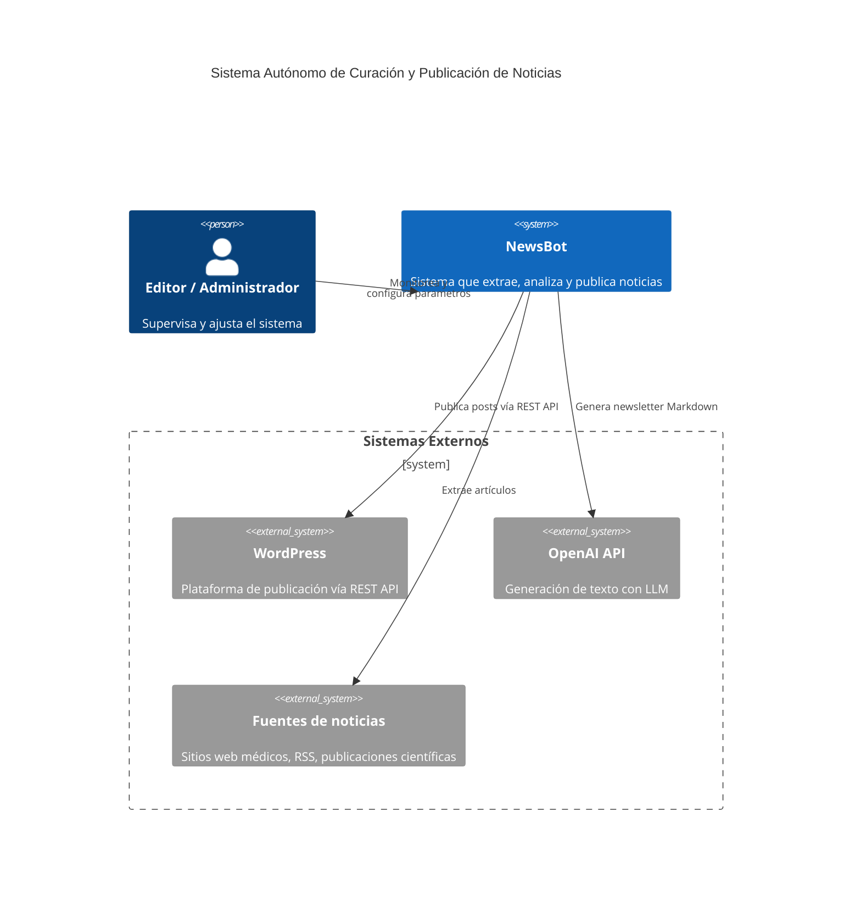
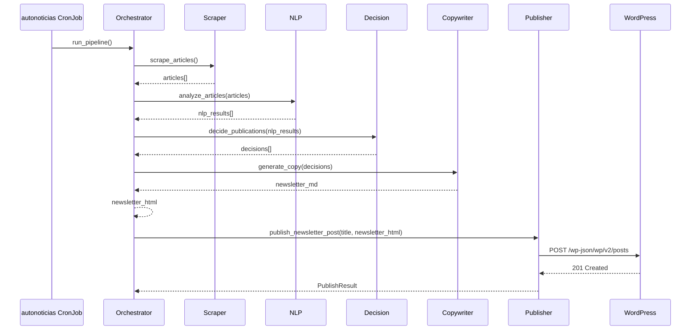

# 📰 Autonomous NewsBot System

**NewsBot** es un sistema autónomo que recopila, analiza y publica noticias relevantes sobre el cáncer de seno. Combina web scraping, procesamiento de lenguaje natural (NLP), razonamiento automático y publicación en WordPress.

---

## 🚀 Características Principales

- 🔍 **Web Scraping**: Extrae artículos recientes de fuentes médicas confiables.
- 🧠 **NLP & LLM**: Analiza contenido usando palabras clave y modelos de lenguaje avanzados.
- 🗳️ **Motor de Decisión**: Selecciona qué noticias deben publicarse y cuándo.
- ✍️ **Copywriting Automatizado**: Genera newsletters en Markdown con estilo profesional.
- 📤 **Publicación en WordPress**: Integra directamente con WordPress vía REST API.
- ⏱️ **Ejecución Programada**: Se ejecuta automáticamente en días y horarios definidos.

---

## 🏗️ Estructura del Proyecto

```

.
├── services/              # Componentes del sistema
│   ├── scraper/           # Extracción de noticias
│   ├── nlp/               # Análisis semántico
│   ├── decision_engine/   # Lógica de decisión
│   ├── copywriter/        # Generación de texto vía LLM
│   ├── publisher/         # Cliente WordPress
│   ├── orchestrator/      # Coordinador de servicios
│   └── shared/            # Modelos comunes
├── run_bot.sh             # Script principal
├── entrypoint.sh          # Entrada del contenedor
├── crontab.template       # Plantilla para tareas programadas
├── docker-compose.yml     # Orquestación de contenedores
├── Dockerfile             # Imagen del servicio
└── .env                   # Variables sensibles (no versionado)

````

---

## ⚙️ Despliegue Rápido

Para una guía más detallada, consulta el archivo [DEPLOYMENT.md](./DEPLOYMENT.md).

### 1. Configurar entorno

Crea un archivo `.env` basado en el siguiente formato:

```env
OPENAI_API_KEY=tu_api_key_openai
WP_POSTS_ENDPOINT=https://tusitio.com
WP_USER=usuario
WP_PASSWORD=contraseña
WEEKLY_DAY=1
WEEKLY_TIME=06:00
DAYS_INTERVAL=3
````

### 2. Construir y ejecutar

```bash
docker compose up -d --build
```

### 3. Ver logs

```bash
docker compose logs -f newsbot
```

### 4. Ejecutar manualmente (opcional)

```bash
docker compose exec newsbot /app/run_bot.sh
```

---

## 📊 Diagramas de Architectura

### 1. Diagrama de Contexto


### 2. Flujo de Ejecución


## 🧠 Tecnologías Utilizadas

* Python v3.13+
* Docker v28+
* Docker Compose v2.34+
* OpenAI GPT (vía API)
* WordPress REST API
* cron (tareas programadas en contenedor)
* Markdown → HTML

---

## 🛡️ Consideraciones de Seguridad

* **Nunca publiques `.env` o tus claves API.**
* Usa usuarios de WordPress con permisos restringidos.
* Revisa la legalidad del scraping para cada fuente utilizada.

---
