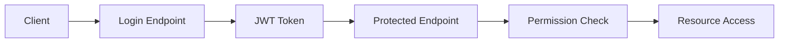

# Authentication API Documentation

JWT-based authentication and role-based access control (RBAC) system for PreventIA News Analytics.

## Overview

The authentication system provides secure JWT token-based authentication with comprehensive role-based access control (RBAC) for all PreventIA system operations.

### Features

- **JWT Token Management**: Secure token creation, validation, and expiration
- **Role-Based Access Control**: Hierarchical permission system
- **Security Features**: Token tampering protection, secure defaults
- **FastAPI Integration**: Dependency injection for protected endpoints

## Authentication Flow



## JWT Token Management

### Token Structure

```json
{
  "user_id": 123,
  "username": "john_doe",
  "email": "john@example.com",
  "roles": ["source_editor"],
  "permissions": ["sources:read", "sources:update"],
  "exp": 1625097600,
  "iat": 1625094000,
  "iss": "preventia-analytics",
  "aud": "preventia-users"
}
```

### Token Creation

```python
from services.api.auth.jwt_handler import create_access_token

user_data = {
    "user_id": 123,
    "username": "john_doe",
    "email": "john@example.com",
    "roles": ["source_editor"],
    "permissions": ["sources:read", "sources:update"]
}

token = create_access_token(user_data)
```

### Token Validation

```python
from services.api.auth.jwt_handler import verify_token, decode_token

# Quick validation
is_valid = verify_token(token)

# Full decode with user data
token_data = decode_token(token)
```

## Role-Based Access Control (RBAC)

### Available Roles

| Role | Description | Permissions |
|------|-------------|-------------|
| `system_admin` | System Administrator | `*` (all permissions) |
| `source_admin` | Source Administrator | `sources:*`, `compliance:read` |
| `source_editor` | Source Editor | `sources:read`, `sources:update`, `sources:validate` |
| `source_viewer` | Source Viewer | `sources:read` |
| `compliance_officer` | Compliance Officer | `compliance:*`, `audit:read`, `legal:manage` |
| `analyst` | Data Analyst | `analytics:read`, `sources:read` |

### Permission System

#### Permission Format
```
resource:action
```

Examples:
- `sources:read` - Read news sources
- `sources:create` - Create new sources
- `sources:update` - Update existing sources
- `sources:delete` - Delete sources
- `compliance:validate` - Validate compliance
- `*` - Wildcard (all permissions)

#### Resource-Level Permissions
```
sources:*     # All source operations
compliance:*  # All compliance operations
audit:*       # All audit operations
```

### Role Management

```python
from services.api.auth.role_manager import RoleManager

role_manager = RoleManager(db_manager)

# Check user permissions
has_permission = await role_manager.has_permission(user_id, "sources:update")

# Check user roles
has_role = await role_manager.has_role(user_id, "source_editor")

# Assign role to user
success = await role_manager.assign_role(user_id, role_id, assigned_by_user_id)

# Revoke role from user
success = await role_manager.revoke_role(user_id, role_id)
```

## FastAPI Integration

### Authentication Dependencies

```python
from services.api.auth.dependencies import (
    get_current_user,
    require_permission,
    require_role
)

# Basic authentication
@app.get("/protected")
async def protected_endpoint(
    current_user: AuthenticatedUser = Depends(get_current_user)
):
    return {"user": current_user.username}

# Permission-based protection
@app.get("/sources")
async def list_sources(
    current_user: AuthenticatedUser = Depends(require_permission("sources:read"))
):
    return {"sources": [...]}

# Role-based protection
@app.get("/admin")
async def admin_panel(
    current_user: AuthenticatedUser = Depends(require_role("source_admin"))
):
    return {"admin": "panel"}
```

### AuthenticatedUser Object

```python
class AuthenticatedUser:
    id: int
    username: str
    email: str
    full_name: str
    is_active: bool
    is_superuser: bool
    roles: List[str]
    permissions: List[str]

    def has_permission(self, permission: str) -> bool
    def has_role(self, role: str) -> bool
    def has_any_role(self, roles: List[str]) -> bool
    def has_all_roles(self, roles: List[str]) -> bool
```

## Security Features

### Token Security

- **Expiration**: Configurable token expiration (default 30 minutes)
- **Tampering Protection**: HMAC signature validation
- **Secure Headers**: Issuer and audience validation
- **Refresh Mechanism**: Token refresh without re-authentication

### Environment Configuration

```bash
# Required for production
JWT_SECRET_KEY=your-super-secret-key-change-in-production

# Optional configuration
JWT_EXPIRE_MINUTES=30
ENVIRONMENT=production
```

### Development vs Production

```python
# Development: Uses default key with warning
# Production: Requires JWT_SECRET_KEY environment variable

if ENVIRONMENT == 'production' and not JWT_SECRET_KEY:
    raise ValueError("JWT_SECRET_KEY required for production")
```

## Database Schema

### User Tables

```sql
-- Users table
CREATE TABLE users (
    id SERIAL PRIMARY KEY,
    username VARCHAR(100) UNIQUE NOT NULL,
    email VARCHAR(255) UNIQUE NOT NULL,
    full_name VARCHAR(255) NOT NULL,
    password_hash VARCHAR(255) NOT NULL,
    is_active BOOLEAN DEFAULT TRUE,
    is_superuser BOOLEAN DEFAULT FALSE,
    last_login TIMESTAMP,
    failed_login_attempts INTEGER DEFAULT 0,
    account_locked_until TIMESTAMP,
    password_changed_at TIMESTAMP DEFAULT NOW(),
    created_at TIMESTAMP DEFAULT NOW(),
    updated_at TIMESTAMP DEFAULT NOW()
);

-- Roles table
CREATE TABLE user_roles (
    id SERIAL PRIMARY KEY,
    name VARCHAR(50) UNIQUE NOT NULL,
    description TEXT,
    permissions JSON DEFAULT '[]',
    is_system_role BOOLEAN DEFAULT FALSE,
    created_at TIMESTAMP DEFAULT NOW(),
    updated_at TIMESTAMP DEFAULT NOW()
);

-- Role assignments table
CREATE TABLE user_role_assignments (
    id SERIAL PRIMARY KEY,
    user_id INTEGER REFERENCES users(id),
    role_id INTEGER REFERENCES user_roles(id),
    assigned_at TIMESTAMP DEFAULT NOW(),
    assigned_by INTEGER REFERENCES users(id),
    expires_at TIMESTAMP,
    UNIQUE(user_id, role_id)
);
```

## Error Handling

### Authentication Errors

```python
# Invalid token
{
    "status_code": 401,
    "detail": "Invalid token: signature verification failed",
    "headers": {"WWW-Authenticate": "Bearer"}
}

# Expired token
{
    "status_code": 401,
    "detail": "Token has expired",
    "headers": {"WWW-Authenticate": "Bearer"}
}

# Insufficient permissions
{
    "status_code": 403,
    "detail": "Permission required: sources:update"
}

# Missing role
{
    "status_code": 403,
    "detail": "Role required: source_admin"
}
```

## Usage Examples

### Creating a Protected Endpoint

```python
from fastapi import FastAPI, Depends
from services.api.auth.dependencies import require_permission

app = FastAPI()

@app.get("/api/sources/{source_id}")
async def get_source(
    source_id: int,
    current_user = Depends(require_permission("sources:read"))
):
    # User has been authenticated and has sources:read permission
    return await get_source_by_id(source_id)

@app.post("/api/sources")
async def create_source(
    source_data: dict,
    current_user = Depends(require_permission("sources:create"))
):
    # User has sources:create permission
    return await create_new_source(source_data)
```

### Multiple Permission Requirements

```python
from services.api.auth.dependencies import require_any_role, require_all_permissions

@app.delete("/api/sources/{source_id}")
async def delete_source(
    source_id: int,
    current_user = Depends(require_any_role(["source_admin", "system_admin"]))
):
    # User must have either source_admin OR system_admin role
    return await delete_source_by_id(source_id)
```

### Custom Permission Logic

```python
from services.api.auth.dependencies import get_current_user, PermissionChecker

@app.put("/api/sources/{source_id}/compliance")
async def update_source_compliance(
    source_id: int,
    current_user = Depends(get_current_user)
):
    permission_checker = PermissionChecker(current_user)

    if not permission_checker.can_validate_compliance():
        raise HTTPException(403, "Compliance validation permission required")

    return await update_compliance_status(source_id)
```

## Integration Testing

The authentication system is fully covered by integration tests:

```bash
# Run authentication integration tests
pytest tests/integration/test_auth_integration.py -v

# Test specific authentication scenarios
pytest tests/integration/test_auth_integration.py::TestAuthenticationIntegration::test_jwt_token_lifecycle -v
```

## Performance Considerations

- **Token Validation**: < 1ms per request
- **Permission Checking**: In-memory operations, negligible overhead
- **Database Queries**: Cached user/role data for performance
- **Concurrent Operations**: Thread-safe JWT operations

## Migration Guide

For existing systems without authentication:

1. **Install Dependencies**: JWT and authentication libraries included
2. **Run Migrations**: User tables created automatically
3. **Create Initial Roles**: Use CLI tools to set up roles
4. **Protect Endpoints**: Add authentication dependencies gradually
5. **Test Integration**: Use provided integration tests

---

**Status**: ✅ Production Ready
**Testing**: Comprehensive integration test coverage
**Security**: JWT best practices implemented
**Documentation**: Complete API and usage examples
