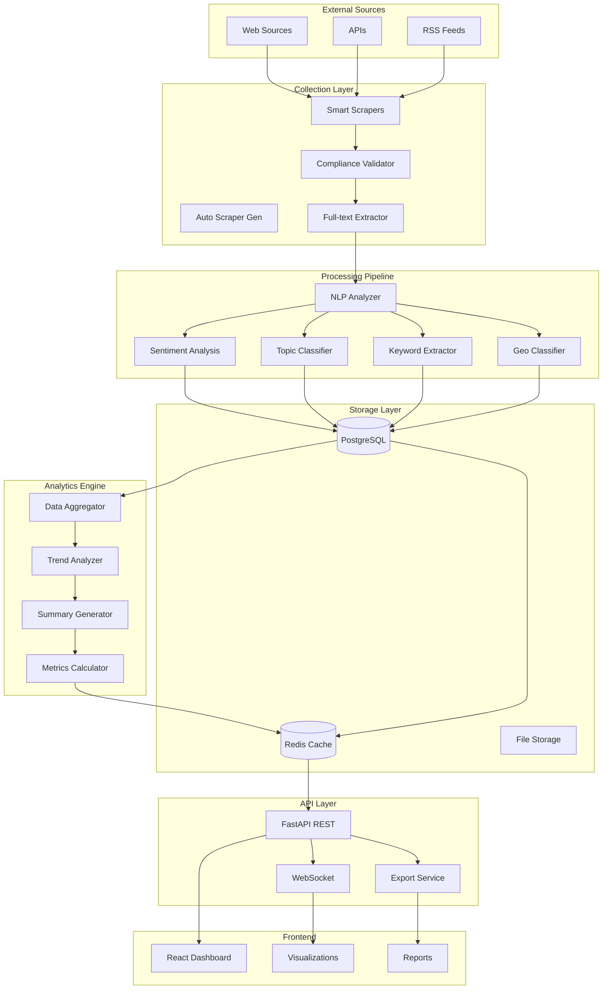

# Data Flow Architecture

This document describes the complete data flow architecture of the PreventIA News Analytics system, including data collection, processing, storage, and visualization pipelines.

## 🔄 High-Level Data Flow Overview



## 📊 Detailed Data Flow Pipelines

### 1. Article Collection Pipeline

#### Phase 1: Source Discovery & Validation
```
Potential Source → Compliance Check → Structure Analysis → Scraper Generation
     ↓                    ↓                   ↓                  ↓
Domain Input → robots.txt Check → CMS Detection → Template Selection
     ↓                    ↓                   ↓                  ↓
Legal Review → Rate Limit Setup → Selector Discovery → Code Generation
```

#### Phase 2: Content Extraction
```
Target URL → HTTP Request → Content Parse → Data Extraction → Quality Check
    ↓            ↓             ↓              ↓               ↓
Scraper Run → HTML Download → BeautifulSoup → Field Mapping → Validation
    ↓            ↓             ↓              ↓               ↓
Rate Limit → Content Cache → Structure Parse → Data Transform → Hash Check
```

#### Phase 3: Storage Preparation
```
Raw Article → Content Hash → Duplicate Check → Data Normalization → Database Insert
     ↓            ↓              ↓                  ↓                  ↓
Field Map → SHA-256 Hash → Hash Comparison → Field Standardization → PostgreSQL
     ↓            ↓              ↓                  ↓                  ↓
Metadata → Unique ID → Skip/Process → Type Conversion → Transaction
```

### 2. NLP Processing Pipeline

#### Text Preprocessing
```
Raw Article Text → Language Detection → Text Cleaning → Tokenization → Normalization
        ↓                 ↓               ↓             ↓              ↓
HTML Removal → spaCy Language → Strip HTML → Word Tokens → Lowercase
        ↓                 ↓               ↓             ↓              ↓
Content Extraction → Confidence Score → Text Normalize → Sentence Split → Lemmatization
```

#### Sentiment Analysis Flow
```
Preprocessed Text → VADER Analysis → Score Calculation → Threshold Apply → Label Assignment
        ↓                ↓               ↓                ↓               ↓
Clean Text → Polarity Scores → Compound Score → Medical Threshold → Positive/Negative/Neutral
        ↓                ↓               ↓                ↓               ↓
Medical Context → Positive/Negative → [-1, 1] Range → ±0.3 Threshold → Confidence Score
```

#### Topic Classification Flow
```
Article Content → Keyword Matching → Category Scoring → Confidence Calc → Topic Assignment
        ↓               ↓                ↓               ↓                ↓
Title + Summary → Medical Keywords → Weight Scoring → Score Normalize → Primary/Secondary
        ↓               ↓                ↓               ↓                ↓
Full Text → Category Rules → Relevance Score → Threshold Check → Category Label
```

### 3. Analytics Aggregation Pipeline

#### Real-time Metrics
```
New Article → Immediate Processing → Cache Update → Dashboard Refresh → Notification
     ↓              ↓                    ↓              ↓                ↓
Database Insert → NLP Analysis → Redis Update → WebSocket Push → User Alert
     ↓              ↓                    ↓              ↓                ↓
Trigger Event → Processing Queue → Metric Calc → Live Dashboard → Real-time Feed
```

#### Batch Analytics
```
Schedule Trigger → Data Query → Aggregation → Cache Storage → Report Generation
       ↓             ↓           ↓             ↓              ↓
Cron Job → PostgreSQL → Group By → Redis Cache → PDF/CSV Export
       ↓             ↓           ↓             ↓              ↓
Daily/Weekly → Time Range → Statistical Calc → Key Metrics → Downloadable Reports
```

### 4. API Data Flow

#### REST API Request Flow
```
Client Request → Authentication → Rate Limiting → Route Handler → Database Query
      ↓              ↓               ↓              ↓               ↓
HTTP Request → JWT Validation → Rate Check → FastAPI Router → PostgreSQL/Redis
      ↓              ↓               ↓              ↓               ↓
Headers/Body → Token Decode → Limit Check → Business Logic → Query Execution
      ↓              ↓               ↓              ↓               ↓
Response → User Context → Allow/Deny → Data Processing → Result Set
```

#### WebSocket Real-time Flow
```
WebSocket Connect → Authentication → Subscription → Event Listen → Data Push
        ↓               ↓              ↓             ↓            ↓
Client Connect → Token Validate → Channel Join → Database Trigger → Live Update
        ↓               ↓              ↓             ↓            ↓
Persistent Conn → Permission Check → Topic Subscribe → Change Event → JSON Push
```

## 🗄️ Database Schema and Relationships

### Core Tables Data Flow
```sql
-- Primary article flow
news_sources → articles → article_keywords
     ↓            ↓            ↓
Source Config → Article Data → Extracted Keywords
     ↓            ↓            ↓
Compliance → NLP Results → Relevance Scores

-- Analytics aggregation flow
articles → weekly_analytics → dashboard_cache
    ↓           ↓                ↓
Raw Data → Aggregated Metrics → Cached Results
    ↓           ↓                ↓
Processing → Statistical Analysis → Fast Queries
```

### Data Relationships
```
news_sources (1) ←→ (many) articles
articles (1) ←→ (many) article_keywords
articles (1) ←→ (1) sentiment_analysis
articles (many) ←→ (1) weekly_analytics
```

## 📈 Performance Optimization Strategies

### Caching Layers
```
Request → L1 Cache (Redis) → L2 Cache (PostgreSQL) → L3 (Computation)
   ↓           ↓                    ↓                      ↓
API Call → Key Lookup → Query Result Cache → Full Processing
   ↓           ↓                    ↓                      ↓
Sub-second → 50ms response → 500ms response → 2-5s response
```

### Batch Processing Optimization
```
Individual Processing:
Article → NLP → Database (2-3s per article)

Batch Processing:
[Articles] → Batch NLP → Bulk Insert (0.5s per article)
     ↓           ↓            ↓
100 Articles → Vectorized → Transaction (50s total)
```

### Query Optimization
```
Dashboard Query → Index Check → Cache Check → Query Plan → Result
       ↓             ↓            ↓            ↓          ↓
Complex Analytics → B-tree Index → Redis Lookup → Optimized SQL → JSON Response
       ↓             ↓            ↓            ↓          ↓
<3s Response → Index Scan → Cache Hit → Parallel Query → Formatted Data
```

## 🔄 Error Handling and Retry Logic

### Scraper Error Flow
```
Scraper Error → Error Classification → Retry Decision → Backoff Strategy → Logging
      ↓               ↓                    ↓               ↓              ↓
HTTP Error → Temporary/Permanent → Retry/Skip → Exponential → Error DB
      ↓               ↓                    ↓               ↓              ↓
Network Issue → Error Code Analysis → Queue Retry → 2^n seconds → Monitoring
```

### Processing Error Flow
```
NLP Error → Error Capture → Partial Save → Error Queue → Manual Review
     ↓           ↓             ↓             ↓              ↓
Analysis Fail → Exception Log → Save Raw → Failed Queue → Admin Dashboard
     ↓           ↓             ↓             ↓              ↓
Sentiment Fail → Stack Trace → Article + Error → Retry Later → Error Analysis
```

## 📊 Data Quality Assurance

### Validation Pipeline
```
Raw Data → Schema Validation → Content Validation → Business Rules → Quality Score
    ↓           ↓                   ↓                  ↓               ↓
Input Data → Pydantic Models → Content Checks → Domain Rules → Quality Metrics
    ↓           ↓                   ↓                  ↓               ↓
JSON/HTML → Type Validation → Length/Format → Medical Relevance → 0-1 Score
```

### Duplicate Detection
```
New Article → Content Hash → Hash Lookup → Similarity Check → Insert/Skip
     ↓            ↓             ↓             ↓               ↓
Article Text → SHA-256 → Database Query → Fuzzy Matching → Decision
     ↓            ↓             ↓             ↓               ↓
Normalized → Unique Hash → Existing Check → Content Compare → Avoid Duplicates
```

## 🚀 Scalability Patterns

### Horizontal Scaling
```
Load Balancer → API Instances → Database Pool → Cache Cluster
      ↓             ↓               ↓              ↓
Traffic Split → Multiple FastAPI → Connection Pool → Redis Cluster
      ↓             ↓               ↓              ↓
Round Robin → Independent Processes → PostgreSQL → Distributed Cache
```

### Vertical Scaling
```
Single Instance → Resource Monitoring → Auto-scaling → Performance Tuning
      ↓                  ↓                  ↓              ↓
CPU/Memory → Metrics Collection → Scale Up/Down → Query Optimization
      ↓                  ↓                  ↓              ↓
Container Limits → Prometheus → Docker Resources → Index Tuning
```

## 📋 Monitoring and Observability

### Data Flow Monitoring
```
Pipeline Stage → Metrics Collection → Alert Rules → Dashboard Display
      ↓               ↓                  ↓            ↓
Processing Step → Performance Data → Threshold Check → Visual Indicators
      ↓               ↓                  ↓            ↓
Success/Failure → Execution Time → SLA Monitoring → Real-time Status
```

### Health Check Flow
```
Health Endpoint → Component Check → Database Check → Cache Check → External API
      ↓               ↓               ↓              ↓             ↓
/health → Service Status → Connection Test → Redis Ping → OpenAI API
      ↓               ↓               ↓              ↓             ↓
JSON Response → Up/Down Status → Query Execution → Cache Hit → API Response
```

## 📚 Data Formats and Standards

### API Response Format
```json
{
  "status": "success|error",
  "data": {...},
  "meta": {
    "timestamp": "2025-07-07T12:00:00Z",
    "count": 100,
    "total": 500,
    "page": 1
  },
  "errors": []
}
```

### Internal Data Format
```json
{
  "article": {
    "id": "uuid",
    "source_id": 1,
    "title": "Article Title",
    "content": "Full article text...",
    "published_at": "2025-07-07T10:00:00Z",
    "sentiment": {
      "label": "positive|negative|neutral",
      "score": 0.75,
      "confidence": 0.85
    },
    "topics": ["treatment", "research"],
    "keywords": ["breast cancer", "therapy"]
  }
}
```

---

**Data Flow Principles:**
- **Idempotency**: All operations can be safely retried
- **Immutability**: Raw data is never modified, only processed
- **Observability**: Every step is logged and monitored
- **Scalability**: Each component can scale independently
- **Reliability**: Comprehensive error handling and recovery

**Last Updated**: 2025-07-07
**Next Review**: 2025-08-07
**Maintainer**: Claude (Technical Director)
