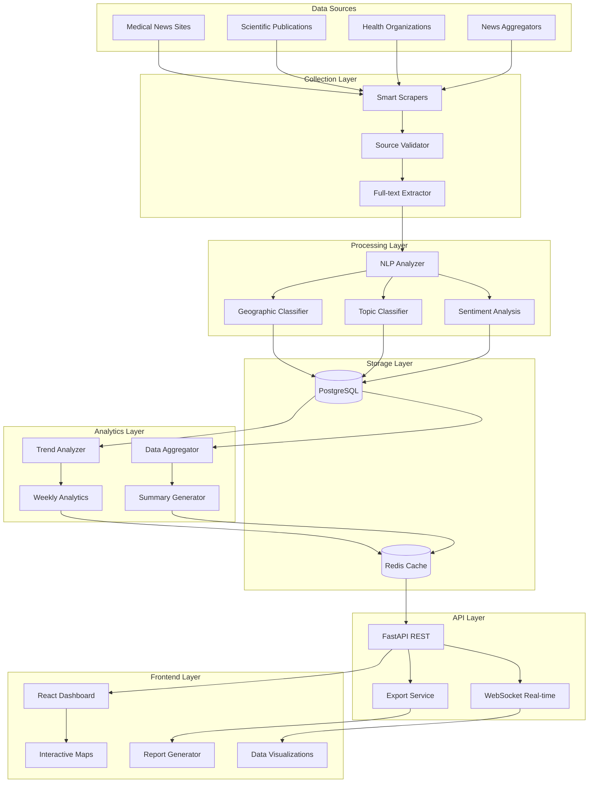

# System Overview - PreventIA News Analytics

## Vision General
PreventIA News Analytics es un sistema de inteligencia mediática especializado en análisis automatizado de noticias sobre cáncer de seno. Transforma datos desestructurados de múltiples fuentes en insights accionables a través de procesamiento de lenguaje natural y visualizaciones interactivas.

## Objetivos Principales
- **Monitoreo automatizado** de cobertura mediática sobre cáncer de seno
- **Análisis de tendencias** en diferentes países y idiomas
- **Inteligencia de mercado** para tomadores de decisiones
- **Visualización interactiva** de patrones y insights

## Arquitectura de Alto Nivel



## Componentes del Sistema

### 1. Collection Layer (Capa de Recolección)
**Propósito**: Extracción inteligente y validada de contenido de fuentes web

#### Smart Scrapers
- Scrapers específicos por sitio web
- Detección automática de estructura de contenido
- Rate limiting inteligente
- Detección de duplicados por hash de contenido

#### Source Validator
- Validación automática de nuevas fuentes
- Verificación de robots.txt y políticas
- Testing de extracción antes de activación
- Monitoreo de salud de fuentes existentes

#### Full-text Extractor
- Extracción de contenido completo de artículos
- Limpieza y normalización de texto
- Detección de idioma automática
- Preservación de metadatos importantes

### 2. Processing Layer (Capa de Procesamiento)
**Propósito**: Análisis inteligente y enriquecimiento de contenido

#### NLP Analyzer
- Extracción de keywords con relevancia
- Detección de entidades médicas
- Análisis de estructura de contenido
- Clasificación de calidad de fuente

#### Sentiment Analysis
- Análisis de tono emocional (positivo/neutral/negativo)
- Confidence scoring para cada clasificación
- Adaptado para terminología médica
- Soporte para español e inglés

#### Topic Classifier
- Clasificación automática por categorías:
  - Prevención
  - Tratamiento
  - Diagnóstico
  - Testimonios
  - Investigación
- Machine learning adaptativo
- Confidence scoring

#### Geographic Classifier
- Identificación automática de país/región
- Clasificación por relevancia geográfica
- Detección de estudios multi-país
- Mapeo a códigos ISO estándar

### 3. Storage Layer (Capa de Almacenamiento)
**Propósito**: Persistencia optimizada para analytics y performance

#### PostgreSQL Database
- **Schema híbrido**: ORM para CRUD, raw SQL para analytics
- **Indexing inteligente**: Optimizado para queries de dashboard
- **JSONB columns**: Flexibilidad para metadata variable
- **Temporal queries**: Optimizado para análisis de tendencias

#### Redis Cache
- Cache de consultas frecuentes del dashboard
- Session storage para usuarios
- Real-time data para WebSocket updates
- Rate limiting para APIs

### 4. Analytics Layer (Capa de Análisis)
**Propósito**: Generación de insights y métricas agregadas

#### Data Aggregator
- Pre-cálculo de métricas semanales/mensuales
- Agregaciones por país, idioma, tema
- Pipeline de procesamiento batch
- Optimización para performance del dashboard

#### Trend Analyzer
- Detección de trending topics
- Análisis de crecimiento/decrecimiento
- Comparaciones temporales
- Identificación de anomalías

#### Summary Generator
- Resúmenes automáticos con LLM
- Insights clave del período
- Contexto de tendencias importantes
- Personalización por audiencia

### 5. API Layer (Capa de APIs)
**Propósito**: Interface programática para frontend y integraciones

#### FastAPI REST
- **CRUD Operations**: Gestión de fuentes y artículos
- **Analytics Endpoints**: Datos para visualizaciones
- **Export APIs**: Múltiples formatos (CSV, JSON, PDF)
- **Authentication**: JWT tokens para seguridad

#### WebSocket Real-time
- Updates en tiempo real del dashboard
- Notificaciones de nuevos artículos importantes
- Status de procesamiento en vivo
- Collaborative features

#### Export Service
- Generación de reportes personalizados
- Múltiples formatos de salida
- Filtros avanzados por fecha/región/tema
- Historial de exportaciones

### 6. Frontend Layer (Capa de Presentación)
**Propósito**: Interface de usuario interactiva y visualizaciones

#### React Dashboard
- **Resumen Semanal**: Métricas clave y tendencias
- **Explorador Temático**: Filtros y segmentación avanzada
- **Análisis de Tono**: Distribución de sentimientos
- **Timeline Interactive**: Evolución temporal

#### Data Visualizations
- Charts responsivos con D3.js/Chart.js
- Visualizaciones interactivas
- Export de gráficos en múltiples formatos
- Personalización de visualizaciones

#### Interactive Maps
- Mapa mundial con Leaflet.js
- Burbujas proporcionales por volumen
- Filtros por idioma y categoría
- Drill-down por país/región

## Flujo de Datos Principales

### 1. Article Processing Pipeline
```
Web Sources → Scrapers → Validation → Full-text Extraction → 
NLP Analysis → Sentiment/Topic Classification → Database Storage → 
Cache Update → Dashboard Refresh
```

### 2. Analytics Generation Pipeline
```
Raw Articles → Weekly Aggregation → Trend Analysis → 
LLM Summary Generation → Cache Storage → API Serving → 
Dashboard Visualization
```

### 3. Real-time Updates Pipeline
```
New Article Detection → Processing Queue → Analysis → 
WebSocket Notification → Dashboard Update → User Notification
```

## Tecnologías Utilizadas

### Backend
- **Python 3.13+**: Lenguaje principal
- **FastAPI**: Framework web moderno y rápido
- **PostgreSQL 16+**: Base de datos principal
- **Redis**: Cache y real-time features
- **SQLAlchemy**: ORM híbrido
- **asyncpg**: Driver PostgreSQL asíncrono
- **spaCy**: Procesamiento de lenguaje natural
- **VADER**: Análisis de sentimientos
- **OpenAI API**: Generación de resúmenes

### Frontend
- **React**: Framework de UI
- **TypeScript**: Tipado estático
- **D3.js/Chart.js**: Visualizaciones
- **Leaflet.js**: Mapas interactivos
- **Material-UI**: Componentes de UI

### Infrastructure
- **Docker**: Containerización
- **Docker Compose**: Orquestación local
- **GitHub Actions**: CI/CD (futuro)
- **Nginx**: Reverse proxy (producción)

## Características Clave del Sistema

### Escalabilidad
- **Horizontal scaling**: Microservicios independientes
- **Database sharding**: Por región/idioma (futuro)
- **Cache distribuido**: Redis cluster
- **Load balancing**: Multiple API instances

### Performance
- **Sub-3s dashboard loading**: Cache inteligente + pre-agregación
- **Concurrent processing**: Async I/O en todo el stack
- **Smart indexing**: Queries optimizadas para analytics
- **CDN ready**: Static assets y reports

### Monitoring & Observability
- **Health checks**: Todos los servicios
- **Metrics collection**: Performance y usage
- **Error tracking**: Centralized logging
- **Alerting**: Critical failures y anomalies

### Security
- **JWT authentication**: API access control
- **Rate limiting**: Protection contra abuse
- **Input validation**: SQL injection prevention
- **HTTPS enforcement**: Todas las comunicaciones

## Roadmap de Desarrollo

### MVP (Fase 1) - Semanas 1-4
- ✅ PostgreSQL setup y migraciones
- ✅ Scrapers básicos funcionando
- 🔄 FastAPI con endpoints básicos
- 🔄 Sentiment analysis pipeline
- 🔄 Dashboard React básico

### Enhanced Analytics (Fase 2) - Semanas 5-8
- 📋 Topic classification avanzada
- 📋 Geographic analysis
- 📋 Weekly analytics automation
- 📋 Interactive visualizations
- 📋 Export functionality

### Advanced Features (Fase 3) - Semanas 9-12
- 📋 Real-time WebSocket updates
- 📋 Advanced filtering
- 📋 Multi-language support expansion
- 📋 Mobile responsive design
- 📋 API rate limiting

### Scale & Optimize (Fase 4) - Semanas 13-16
- 📋 Performance optimization
- 📋 Caching estrategy refinement
- 📋 Additional data sources
- 📋 Advanced analytics (ML trends)
- 📋 Production deployment

## Estado Actual
- **Database**: ✅ PostgreSQL funcionando con schema completo
- **Models**: ✅ SQLAlchemy models implementados
- **Connection**: ✅ Hybrid ORM + raw SQL funcionando
- **Testing**: ✅ Database tests passing
- **Docker**: ✅ PostgreSQL containerizado
- **Next**: 🔄 FastAPI implementation

---
**Última actualización**: 2025-06-27  
**Próxima revisión**: 2025-07-27