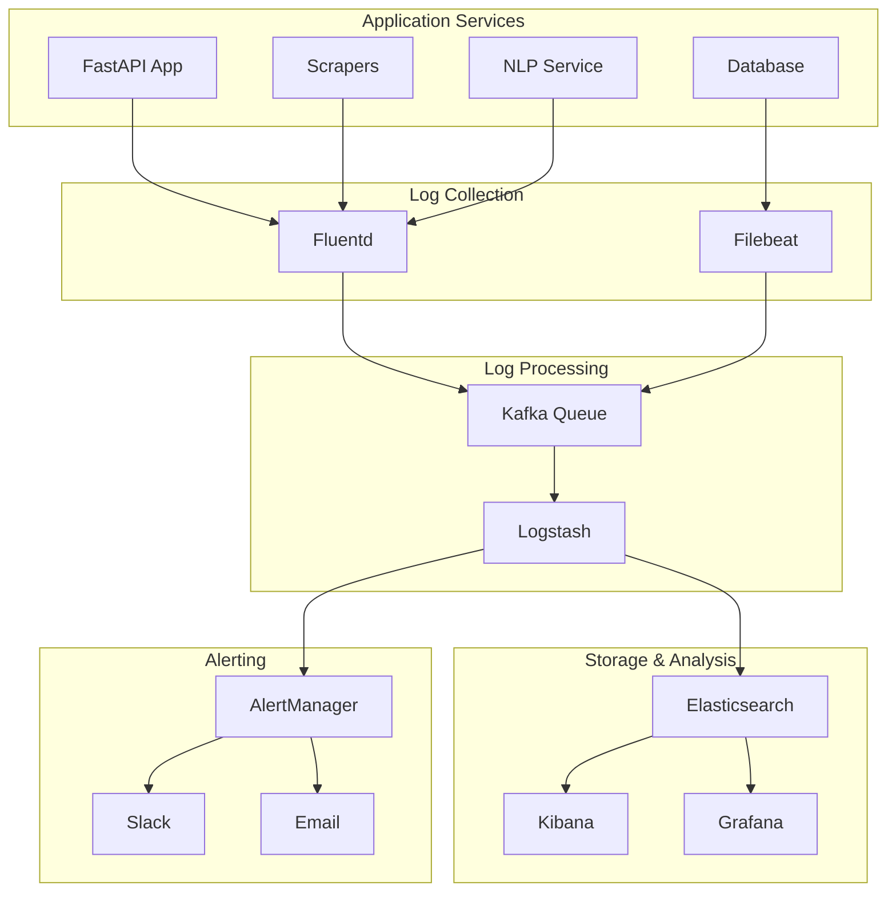

# Logging Strategy

Comprehensive logging strategy for PreventIA News Analytics system, covering structured logging, log aggregation, monitoring, and analysis for production environments.

## 🎯 Overview

### Logging Objectives
1. **Operational Visibility**: Monitor system health and performance
2. **Debugging Support**: Rapid issue identification and resolution
3. **Compliance Tracking**: Audit trails for medical data processing
4. **Performance Analysis**: Identify bottlenecks and optimization opportunities
5. **Security Monitoring**: Detect and track security events

### Logging Principles
- **Structured Logging**: Consistent JSON format for all logs
- **Contextual Information**: Rich metadata for correlation
- **Performance Conscious**: Minimal impact on system performance
- **Retention Policy**: Appropriate retention for compliance and storage costs
- **Privacy Compliant**: No sensitive data in logs

## 📊 Log Levels and Categories

### Log Levels (RFC 5424 Standard)
```python
import logging

# Log levels in order of severity
CRITICAL = 50  # System unusable, immediate action required
ERROR = 40     # Error conditions, functionality impacted
WARNING = 30   # Warning conditions, potential issues
INFO = 20      # Informational messages, normal operation
DEBUG = 10     # Debug information, development only
```

### Application Categories
```yaml
Categories:
  - api: FastAPI application logs
  - scraper: Web scraping operations
  - nlp: Natural language processing
  - database: Database operations and queries
  - auth: Authentication and authorization
  - cache: Redis cache operations
  - compliance: Legal and ethical compliance
  - performance: Performance metrics and profiling
  - security: Security events and monitoring
```

## 🏗️ Logging Architecture

### Centralized Logging Stack


### Log Flow Architecture
1. **Collection**: Applications write structured logs to files/stdout
2. **Aggregation**: Fluentd/Filebeat collect and forward logs
3. **Processing**: Logstash enriches and transforms logs
4. **Storage**: Elasticsearch stores processed logs
5. **Visualization**: Kibana/Grafana provide dashboards
6. **Alerting**: Rules trigger notifications for critical events

## 🔧 Implementation Strategy

### 1. Structured Logging Configuration

#### Python Logging Setup (`services/shared/logging/config.py`)
```python
import logging
import json
import sys
from datetime import datetime
from typing import Any, Dict
from pythonjsonlogger import jsonlogger

class CustomJsonFormatter(jsonlogger.JsonFormatter):
    """Custom JSON formatter with additional context"""

    def add_fields(self, log_record: Dict[str, Any], record: logging.LogRecord, message_dict: Dict[str, Any]):
        super().add_fields(log_record, record, message_dict)

        # Add timestamp in ISO format
        log_record['timestamp'] = datetime.utcnow().isoformat() + 'Z'

        # Add service information
        log_record['service'] = 'preventia-analytics'
        log_record['version'] = '1.0.0'

        # Add request context if available
        if hasattr(record, 'request_id'):
            log_record['request_id'] = record.request_id
        if hasattr(record, 'user_id'):
            log_record['user_id'] = record.user_id
        if hasattr(record, 'operation'):
            log_record['operation'] = record.operation

        # Add performance metrics
        if hasattr(record, 'duration'):
            log_record['duration_ms'] = record.duration
        if hasattr(record, 'memory_usage'):
            log_record['memory_mb'] = record.memory_usage

def setup_logging(service_name: str, log_level: str = 'INFO'):
    """Setup structured logging for a service"""

    # Create logger
    logger = logging.getLogger(service_name)
    logger.setLevel(getattr(logging, log_level.upper()))

    # Remove existing handlers
    for handler in logger.handlers[:]:
        logger.removeHandler(handler)

    # Console handler with JSON formatting
    console_handler = logging.StreamHandler(sys.stdout)
    json_formatter = CustomJsonFormatter(
        '%(timestamp)s %(level)s %(name)s %(message)s'
    )
    console_handler.setFormatter(json_formatter)
    logger.addHandler(console_handler)

    # File handler for local development
    if log_level.upper() == 'DEBUG':
        file_handler = logging.FileHandler(f'logs/{service_name}.log')
        file_handler.setFormatter(json_formatter)
        logger.addHandler(file_handler)

    return logger

# Service-specific loggers
api_logger = setup_logging('api')
scraper_logger = setup_logging('scraper')
nlp_logger = setup_logging('nlp')
db_logger = setup_logging('database')
```

#### FastAPI Logging Middleware
```python
import time
import uuid
from fastapi import FastAPI, Request
from starlette.middleware.base import BaseHTTPMiddleware

class LoggingMiddleware(BaseHTTPMiddleware):
    """Middleware for request/response logging"""

    async def dispatch(self, request: Request, call_next):
        # Generate request ID
        request_id = str(uuid.uuid4())
        request.state.request_id = request_id

        # Log request
        start_time = time.time()
        api_logger.info(
            "HTTP request started",
            extra={
                'request_id': request_id,
                'method': request.method,
                'url': str(request.url),
                'client_ip': request.client.host,
                'user_agent': request.headers.get('User-Agent'),
                'operation': 'http_request'
            }
        )

        # Process request
        try:
            response = await call_next(request)
            duration = (time.time() - start_time) * 1000

            # Log successful response
            api_logger.info(
                "HTTP request completed",
                extra={
                    'request_id': request_id,
                    'status_code': response.status_code,
                    'duration': duration,
                    'operation': 'http_response'
                }
            )

            return response

        except Exception as e:
            duration = (time.time() - start_time) * 1000

            # Log error response
            api_logger.error(
                "HTTP request failed",
                extra={
                    'request_id': request_id,
                    'error': str(e),
                    'error_type': type(e).__name__,
                    'duration': duration,
                    'operation': 'http_error'
                }
            )
            raise

# Add middleware to FastAPI app
app = FastAPI()
app.add_middleware(LoggingMiddleware)
```

### 2. Service-Specific Logging

#### API Service Logging
```python
# services/api/logging_config.py
from services.shared.logging.config import api_logger

def log_endpoint_access(endpoint: str, user_id: str = None, **kwargs):
    """Log API endpoint access"""
    api_logger.info(
        f"Endpoint accessed: {endpoint}",
        extra={
            'endpoint': endpoint,
            'user_id': user_id,
            'operation': 'endpoint_access',
            **kwargs
        }
    )

def log_business_logic(operation: str, entity_id: str = None, **kwargs):
    """Log business logic operations"""
    api_logger.info(
        f"Business operation: {operation}",
        extra={
            'operation': operation,
            'entity_id': entity_id,
            'category': 'business_logic',
            **kwargs
        }
    )

def log_performance_metric(operation: str, duration: float, **kwargs):
    """Log performance metrics"""
    api_logger.info(
        f"Performance metric: {operation}",
        extra={
            'operation': operation,
            'duration': duration,
            'category': 'performance',
            **kwargs
        }
    )

# Usage examples
@app.get("/api/v1/analytics/sentiment")
async def get_sentiment_analytics(request: Request):
    request_id = request.state.request_id

    log_endpoint_access(
        'get_sentiment_analytics',
        request_id=request_id
    )

    start_time = time.time()
    try:
        # Business logic here
        data = await sentiment_service.get_analytics()

        duration = (time.time() - start_time) * 1000
        log_performance_metric(
            'sentiment_analytics_query',
            duration=duration,
            record_count=len(data),
            request_id=request_id
        )

        return data

    except Exception as e:
        api_logger.error(
            "Failed to get sentiment analytics",
            extra={
                'request_id': request_id,
                'error': str(e),
                'operation': 'get_sentiment_analytics'
            }
        )
        raise
```

#### Scraper Service Logging
```python
# services/scraper/logging_config.py
from services.shared.logging.config import scraper_logger

def log_scraper_start(source_name: str, source_id: int, **kwargs):
    """Log scraper execution start"""
    scraper_logger.info(
        f"Scraper started: {source_name}",
        extra={
            'source_name': source_name,
            'source_id': source_id,
            'operation': 'scraper_start',
            **kwargs
        }
    )

def log_article_processed(article_id: str, title: str, source: str, **kwargs):
    """Log individual article processing"""
    scraper_logger.info(
        f"Article processed: {title[:50]}...",
        extra={
            'article_id': article_id,
            'title': title,
            'source': source,
            'operation': 'article_processed',
            **kwargs
        }
    )

def log_compliance_check(source: str, check_type: str, result: bool, **kwargs):
    """Log compliance check results"""
    scraper_logger.info(
        f"Compliance check: {check_type} for {source}",
        extra={
            'source': source,
            'check_type': check_type,
            'compliance_result': result,
            'operation': 'compliance_check',
            **kwargs
        }
    )

# Usage in scraper
async def scrape_source(source_id: int):
    source = await get_source(source_id)

    log_scraper_start(
        source.name,
        source_id,
        base_url=source.base_url
    )

    try:
        # Compliance check
        compliance_result = await check_compliance(source)
        log_compliance_check(
            source.name,
            'robots_txt',
            compliance_result.robots_txt_compliant
        )

        if not compliance_result.is_compliant:
            scraper_logger.warning(
                f"Compliance failure for {source.name}",
                extra={
                    'source': source.name,
                    'violations': compliance_result.violations,
                    'operation': 'compliance_failure'
                }
            )
            return

        # Process articles
        articles = await extract_articles(source)
        for article in articles:
            log_article_processed(
                article.id,
                article.title,
                source.name,
                word_count=article.word_count
            )

        scraper_logger.info(
            f"Scraper completed: {source.name}",
            extra={
                'source': source.name,
                'articles_processed': len(articles),
                'operation': 'scraper_complete'
            }
        )

    except Exception as e:
        scraper_logger.error(
            f"Scraper failed: {source.name}",
            extra={
                'source': source.name,
                'error': str(e),
                'operation': 'scraper_error'
            }
        )
        raise
```

#### Database Logging
```python
# services/data/database/logging_config.py
from services.shared.logging.config import db_logger
import time
from functools import wraps

def log_database_operation(operation_type: str):
    """Decorator for database operation logging"""
    def decorator(func):
        @wraps(func)
        async def wrapper(*args, **kwargs):
            start_time = time.time()
            operation_id = str(uuid.uuid4())

            db_logger.info(
                f"Database operation started: {operation_type}",
                extra={
                    'operation_id': operation_id,
                    'operation_type': operation_type,
                    'operation': 'db_start'
                }
            )

            try:
                result = await func(*args, **kwargs)
                duration = (time.time() - start_time) * 1000

                db_logger.info(
                    f"Database operation completed: {operation_type}",
                    extra={
                        'operation_id': operation_id,
                        'operation_type': operation_type,
                        'duration': duration,
                        'operation': 'db_complete'
                    }
                )

                return result

            except Exception as e:
                duration = (time.time() - start_time) * 1000

                db_logger.error(
                    f"Database operation failed: {operation_type}",
                    extra={
                        'operation_id': operation_id,
                        'operation_type': operation_type,
                        'duration': duration,
                        'error': str(e),
                        'operation': 'db_error'
                    }
                )
                raise
        return wrapper
    return decorator

# Usage
class DatabaseManager:

    @log_database_operation('insert_article')
    async def insert_article(self, article_data: dict):
        # Database insertion logic
        pass

    @log_database_operation('get_articles')
    async def get_articles(self, filters: dict):
        # Database query logic
        pass
```

## 📋 Log Aggregation and Processing

### 1. Fluentd Configuration

Create `fluentd/fluent.conf`:

```conf
# Input configuration
<source>
  @type tail
  path /app/logs/*.log
  pos_file /var/log/fluentd/preventia.log.pos
  tag preventia.*
  format json
  time_key timestamp
  time_format %Y-%m-%dT%H:%M:%S.%L%z
</source>

<source>
  @type forward
  port 24224
  bind 0.0.0.0
</source>

# Filter for enrichment
<filter preventia.**>
  @type record_transformer
  <record>
    hostname ${hostname}
    environment ${ENV['ENVIRONMENT'] || 'development'}
    cluster_name preventia-analytics
  </record>
</filter>

# Filter for sensitive data removal
<filter preventia.**>
  @type grep
  <exclude>
    key message
    pattern /password|token|secret|key/i
  </exclude>
</filter>

# Output to Elasticsearch
<match preventia.**>
  @type elasticsearch
  host elasticsearch
  port 9200
  index_name preventia-logs
  type_name _doc

  <buffer>
    @type file
    path /var/log/fluentd/buffer/preventia
    flush_mode interval
    flush_interval 30s
    chunk_limit_size 2MB
    queue_limit_length 8
    retry_max_interval 30
    retry_forever true
  </buffer>
</match>
```

### 2. Logstash Pipeline Configuration

Create `logstash/pipeline/preventia.conf`:

```conf
input {
  elasticsearch {
    hosts => ["elasticsearch:9200"]
    index => "preventia-logs-*"
  }
}

filter {
  # Parse JSON if not already parsed
  if [message] and [message] !~ /^\{.*\}$/ {
    json {
      source => "message"
    }
  }

  # Add GeoIP information for client IPs
  if [client_ip] {
    geoip {
      source => "client_ip"
      target => "geoip"
    }
  }

  # Parse user agent
  if [user_agent] {
    useragent {
      source => "user_agent"
      target => "ua"
    }
  }

  # Add severity level
  if [level] == "ERROR" or [level] == "CRITICAL" {
    mutate {
      add_field => { "severity" => "high" }
    }
  } else if [level] == "WARNING" {
    mutate {
      add_field => { "severity" => "medium" }
    }
  } else {
    mutate {
      add_field => { "severity" => "low" }
    }
  }

  # Extract performance metrics
  if [duration] {
    if [duration] > 5000 {
      mutate {
        add_tag => [ "slow_operation" ]
      }
    }
  }

  # Medical compliance tagging
  if [operation] =~ /scraper|article|nlp/ {
    mutate {
      add_tag => [ "medical_data_processing" ]
    }
  }
}

output {
  # Send to Elasticsearch with enhanced indexing
  elasticsearch {
    hosts => ["elasticsearch:9200"]
    index => "preventia-processed-%{+YYYY.MM.dd}"
    template_name => "preventia"
    template_pattern => "preventia-*"
    template => "/etc/logstash/templates/preventia-template.json"
  }

  # Send high severity logs to alerting
  if "high" in [severity] {
    http {
      url => "http://alertmanager:9093/api/v1/alerts"
      http_method => "post"
      content_type => "application/json"
      format => "json"
      mapping => {
        "alerts" => [{
          "labels" => {
            "alertname" => "HighSeverityLog"
            "service" => "%{service}"
            "severity" => "critical"
          }
          "annotations" => {
            "summary" => "%{message}"
            "description" => "High severity log detected: %{message}"
          }
        }]
      }
    }
  }
}
```

## 📊 Monitoring and Alerting

### 1. Log-based Alerts

#### AlertManager Configuration (`alertmanager/config.yml`)
```yaml
global:
  smtp_smarthost: 'localhost:587'
  smtp_from: 'alerts@preventia.com'

route:
  group_by: ['alertname', 'service']
  group_wait: 30s
  group_interval: 5m
  repeat_interval: 12h
  receiver: 'web.hook'
  routes:
  - match:
      severity: critical
    receiver: 'critical-alerts'
  - match:
      severity: warning
    receiver: 'warning-alerts'

receivers:
- name: 'web.hook'
  webhook_configs:
  - url: 'http://localhost:5001/'

- name: 'critical-alerts'
  email_configs:
  - to: 'admin@preventia.com'
    subject: 'Critical Alert: {{ .GroupLabels.alertname }}'
    body: |
      {{ range .Alerts }}
      Alert: {{ .Annotations.summary }}
      Description: {{ .Annotations.description }}
      Service: {{ .Labels.service }}
      Severity: {{ .Labels.severity }}
      {{ end }}
  slack_configs:
  - api_url: 'YOUR_SLACK_WEBHOOK_URL'
    channel: '#alerts'
    title: 'Critical Alert'
    text: '{{ range .Alerts }}{{ .Annotations.summary }}{{ end }}'

- name: 'warning-alerts'
  email_configs:
  - to: 'team@preventia.com'
    subject: 'Warning: {{ .GroupLabels.alertname }}'
```

### 2. Prometheus Log Metrics

#### Log Metrics Exporter (`monitoring/log_metrics.py`)
```python
import re
import time
from collections import defaultdict
from prometheus_client import Counter, Histogram, Gauge, start_http_server

# Prometheus metrics
log_messages_total = Counter(
    'log_messages_total',
    'Total number of log messages',
    ['service', 'level', 'operation']
)

request_duration_seconds = Histogram(
    'request_duration_seconds',
    'HTTP request duration in seconds',
    ['method', 'endpoint', 'status_code']
)

scraper_articles_processed = Counter(
    'scraper_articles_processed_total',
    'Total articles processed by scrapers',
    ['source', 'status']
)

database_operations_total = Counter(
    'database_operations_total',
    'Total database operations',
    ['operation_type', 'status']
)

nlp_processing_duration = Histogram(
    'nlp_processing_duration_seconds',
    'NLP processing duration in seconds',
    ['operation_type']
)

class LogMetricsExporter:
    """Export log-based metrics to Prometheus"""

    def __init__(self):
        self.patterns = {
            'api_request': re.compile(r'HTTP request completed.*status_code":\s*(\d+).*duration":\s*([\d.]+)'),
            'scraper_article': re.compile(r'Article processed.*source":\s*"([^"]+)"'),
            'database_op': re.compile(r'Database operation completed.*operation_type":\s*"([^"]+)".*duration":\s*([\d.]+)'),
            'nlp_processing': re.compile(r'NLP processing.*duration":\s*([\d.]+)')
        }

    def process_log_line(self, line: str):
        """Process a single log line and update metrics"""

        # Parse JSON log entry
        try:
            import json
            log_entry = json.loads(line)

            # Update log message counter
            log_messages_total.labels(
                service=log_entry.get('service', 'unknown'),
                level=log_entry.get('level', 'unknown'),
                operation=log_entry.get('operation', 'unknown')
            ).inc()

            # Process specific patterns
            if log_entry.get('operation') == 'http_response':
                request_duration_seconds.labels(
                    method=log_entry.get('method', 'unknown'),
                    endpoint=log_entry.get('endpoint', 'unknown'),
                    status_code=log_entry.get('status_code', 'unknown')
                ).observe(log_entry.get('duration', 0) / 1000.0)

            elif log_entry.get('operation') == 'article_processed':
                scraper_articles_processed.labels(
                    source=log_entry.get('source', 'unknown'),
                    status='success'
                ).inc()

            elif log_entry.get('operation') == 'db_complete':
                database_operations_total.labels(
                    operation_type=log_entry.get('operation_type', 'unknown'),
                    status='success'
                ).inc()

        except (json.JSONDecodeError, KeyError) as e:
            # Handle non-JSON or malformed log entries
            pass

    def tail_log_file(self, log_file_path: str):
        """Tail a log file and process new lines"""
        import subprocess

        process = subprocess.Popen(
            ['tail', '-F', log_file_path],
            stdout=subprocess.PIPE,
            stderr=subprocess.PIPE,
            universal_newlines=True
        )

        try:
            for line in iter(process.stdout.readline, ''):
                self.process_log_line(line.strip())
        except KeyboardInterrupt:
            process.terminate()

if __name__ == '__main__':
    # Start Prometheus metrics server
    start_http_server(8000)

    # Start log processing
    exporter = LogMetricsExporter()
    exporter.tail_log_file('/app/logs/api.log')
```

## 🔒 Security and Compliance

### 1. Sensitive Data Handling

#### Data Sanitization (`services/shared/logging/sanitizers.py`)
```python
import re
from typing import Any, Dict

class LogSanitizer:
    """Sanitize sensitive data from log entries"""

    def __init__(self):
        self.sensitive_patterns = {
            'email': re.compile(r'\b[A-Za-z0-9._%+-]+@[A-Za-z0-9.-]+\.[A-Z|a-z]{2,}\b'),
            'api_key': re.compile(r'\b(?:api[_-]?key|token|secret)["\']?\s*[:=]\s*["\']?([A-Za-z0-9+/=]{20,})', re.IGNORECASE),
            'password': re.compile(r'\b(?:password|pwd|pass)["\']?\s*[:=]\s*["\']?([^\s"\']+)', re.IGNORECASE),
            'credit_card': re.compile(r'\b(?:\d{4}[-\s]?\d{4}[-\s]?\d{4}[-\s]?\d{4})\b'),
            'social_security': re.compile(r'\b\d{3}-\d{2}-\d{4}\b'),
            'ip_address': re.compile(r'\b(?:[0-9]{1,3}\.){3}[0-9]{1,3}\b')
        }

    def sanitize_string(self, text: str) -> str:
        """Sanitize sensitive data from a string"""
        if not isinstance(text, str):
            return text

        sanitized = text

        # Replace sensitive patterns
        for pattern_name, pattern in self.sensitive_patterns.items():
            if pattern_name == 'ip_address':
                # Partially mask IP addresses
                sanitized = pattern.sub(r'XXX.XXX.XXX.XXX', sanitized)
            elif pattern_name == 'email':
                # Partially mask emails
                sanitized = pattern.sub(r'***@***.***', sanitized)
            else:
                # Fully mask other sensitive data
                sanitized = pattern.sub('[REDACTED]', sanitized)

        return sanitized

    def sanitize_dict(self, data: Dict[str, Any]) -> Dict[str, Any]:
        """Recursively sanitize a dictionary"""
        if not isinstance(data, dict):
            return data

        sanitized = {}
        for key, value in data.items():
            if isinstance(value, str):
                sanitized[key] = self.sanitize_string(value)
            elif isinstance(value, dict):
                sanitized[key] = self.sanitize_dict(value)
            elif isinstance(value, list):
                sanitized[key] = [
                    self.sanitize_dict(item) if isinstance(item, dict)
                    else self.sanitize_string(item) if isinstance(item, str)
                    else item
                    for item in value
                ]
            else:
                sanitized[key] = value

        return sanitized

# Integration with logging
sanitizer = LogSanitizer()

class SanitizedJsonFormatter(CustomJsonFormatter):
    """JSON formatter with data sanitization"""

    def format(self, record):
        # Sanitize the log record before formatting
        if hasattr(record, 'msg'):
            record.msg = sanitizer.sanitize_string(str(record.msg))

        # Sanitize extra fields
        for key, value in record.__dict__.items():
            if isinstance(value, (str, dict)):
                if isinstance(value, str):
                    setattr(record, key, sanitizer.sanitize_string(value))
                else:
                    setattr(record, key, sanitizer.sanitize_dict(value))

        return super().format(record)
```

### 2. Audit Logging

#### Compliance Audit Logger (`services/shared/logging/audit.py`)
```python
import json
from datetime import datetime
from typing import Any, Dict, Optional

class AuditLogger:
    """Specialized logger for compliance and audit requirements"""

    def __init__(self):
        self.logger = setup_logging('audit')

    def log_data_access(self, user_id: str, resource: str, action: str,
                       success: bool, details: Optional[Dict[str, Any]] = None):
        """Log data access for compliance"""
        self.logger.info(
            f"Data access: {action} on {resource}",
            extra={
                'audit_type': 'data_access',
                'user_id': user_id,
                'resource': resource,
                'action': action,
                'success': success,
                'timestamp': datetime.utcnow().isoformat(),
                'details': details or {}
            }
        )

    def log_medical_data_processing(self, operation: str, article_count: int,
                                  processing_time: float, compliance_checked: bool):
        """Log medical data processing for compliance"""
        self.logger.info(
            f"Medical data processing: {operation}",
            extra={
                'audit_type': 'medical_data_processing',
                'operation': operation,
                'article_count': article_count,
                'processing_time_ms': processing_time,
                'compliance_checked': compliance_checked,
                'timestamp': datetime.utcnow().isoformat()
            }
        )

    def log_scraper_compliance(self, source: str, compliance_checks: Dict[str, bool],
                             violations: List[str] = None):
        """Log scraper compliance status"""
        self.logger.info(
            f"Scraper compliance check: {source}",
            extra={
                'audit_type': 'scraper_compliance',
                'source': source,
                'compliance_checks': compliance_checks,
                'violations': violations or [],
                'overall_compliant': all(compliance_checks.values()),
                'timestamp': datetime.utcnow().isoformat()
            }
        )

# Global audit logger instance
audit_logger = AuditLogger()
```

## 📈 Performance and Optimization

### 1. Asynchronous Logging

#### High-Performance Logging (`services/shared/logging/async_logger.py`)
```python
import asyncio
import queue
import threading
from typing import Dict, Any

class AsyncLogger:
    """Asynchronous logger to minimize performance impact"""

    def __init__(self, base_logger, buffer_size: int = 1000):
        self.base_logger = base_logger
        self.log_queue = queue.Queue(maxsize=buffer_size)
        self.worker_thread = None
        self.shutdown_event = threading.Event()
        self.start_worker()

    def start_worker(self):
        """Start the background logging worker thread"""
        self.worker_thread = threading.Thread(target=self._log_worker, daemon=True)
        self.worker_thread.start()

    def _log_worker(self):
        """Background thread that processes log entries"""
        while not self.shutdown_event.is_set():
            try:
                # Get log entry with timeout
                log_entry = self.log_queue.get(timeout=1.0)

                # Process the log entry
                level, message, extra = log_entry
                getattr(self.base_logger, level)(message, extra=extra)

                self.log_queue.task_done()

            except queue.Empty:
                continue
            except Exception as e:
                # Log worker errors to stderr
                print(f"Async logger error: {e}", file=sys.stderr)

    def log_async(self, level: str, message: str, extra: Dict[str, Any] = None):
        """Add log entry to async queue"""
        try:
            self.log_queue.put_nowait((level, message, extra or {}))
        except queue.Full:
            # If queue is full, log synchronously as fallback
            getattr(self.base_logger, level)(message, extra=extra)

    def info(self, message: str, **kwargs):
        self.log_async('info', message, kwargs)

    def warning(self, message: str, **kwargs):
        self.log_async('warning', message, kwargs)

    def error(self, message: str, **kwargs):
        self.log_async('error', message, kwargs)

    def shutdown(self):
        """Gracefully shutdown the async logger"""
        # Wait for queue to empty
        self.log_queue.join()

        # Signal shutdown
        self.shutdown_event.set()

        # Wait for worker thread
        if self.worker_thread:
            self.worker_thread.join(timeout=5.0)
```

### 2. Log Rotation and Retention

#### Log Management (`scripts/log_management.py`)
```python
#!/usr/bin/env python3
"""
Log rotation and retention management
"""

import os
import gzip
import shutil
from datetime import datetime, timedelta
from pathlib import Path

class LogManager:
    """Manage log rotation and retention"""

    def __init__(self, log_dir: str = '/app/logs'):
        self.log_dir = Path(log_dir)
        self.retention_days = 30
        self.rotation_size_mb = 100

    def rotate_log_file(self, log_path: Path):
        """Rotate a log file if it exceeds size limit"""
        if not log_path.exists():
            return

        size_mb = log_path.stat().st_size / (1024 * 1024)
        if size_mb > self.rotation_size_mb:
            # Create rotated filename with timestamp
            timestamp = datetime.now().strftime('%Y%m%d_%H%M%S')
            rotated_name = f"{log_path.stem}_{timestamp}.log.gz"
            rotated_path = log_path.parent / rotated_name

            # Compress and move
            with open(log_path, 'rb') as f_in:
                with gzip.open(rotated_path, 'wb') as f_out:
                    shutil.copyfileobj(f_in, f_out)

            # Clear original file
            log_path.write_text('')

            print(f"Rotated {log_path} to {rotated_path}")

    def cleanup_old_logs(self):
        """Remove logs older than retention period"""
        cutoff_date = datetime.now() - timedelta(days=self.retention_days)

        for log_file in self.log_dir.glob('**/*.log*'):
            if log_file.stat().st_mtime < cutoff_date.timestamp():
                log_file.unlink()
                print(f"Deleted old log: {log_file}")

    def run_maintenance(self):
        """Run log maintenance tasks"""
        print(f"Starting log maintenance...")

        # Rotate large files
        for log_file in self.log_dir.glob('**/*.log'):
            self.rotate_log_file(log_file)

        # Cleanup old files
        self.cleanup_old_logs()

        print(f"Log maintenance completed")

if __name__ == '__main__':
    manager = LogManager()
    manager.run_maintenance()
```

## 📚 Related Documentation

- [Debugging Pipeline Guide](../../development/guides/debugging-pipeline.md)
- [Production Deployment](../deployment/production-deployment.md)
- [Metrics Dashboard](metrics-dashboard.md)
- [Security Standards](../../development/standards/security-standards.md)

---

**Logging Strategy Principles:**
- **Structured and Searchable**: JSON format with consistent schema
- **Performance Conscious**: Minimal impact on application performance
- **Security Compliant**: Sensitive data sanitization and audit trails
- **Operationally Useful**: Rich context for debugging and monitoring
- **Scalable**: Handles high-volume logging with proper retention

**Last Updated**: 2025-07-07
**Next Review**: 2025-10-07
**Maintainer**: Claude (Technical Director)
