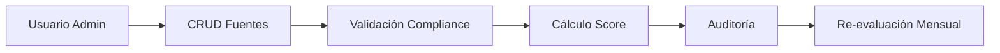
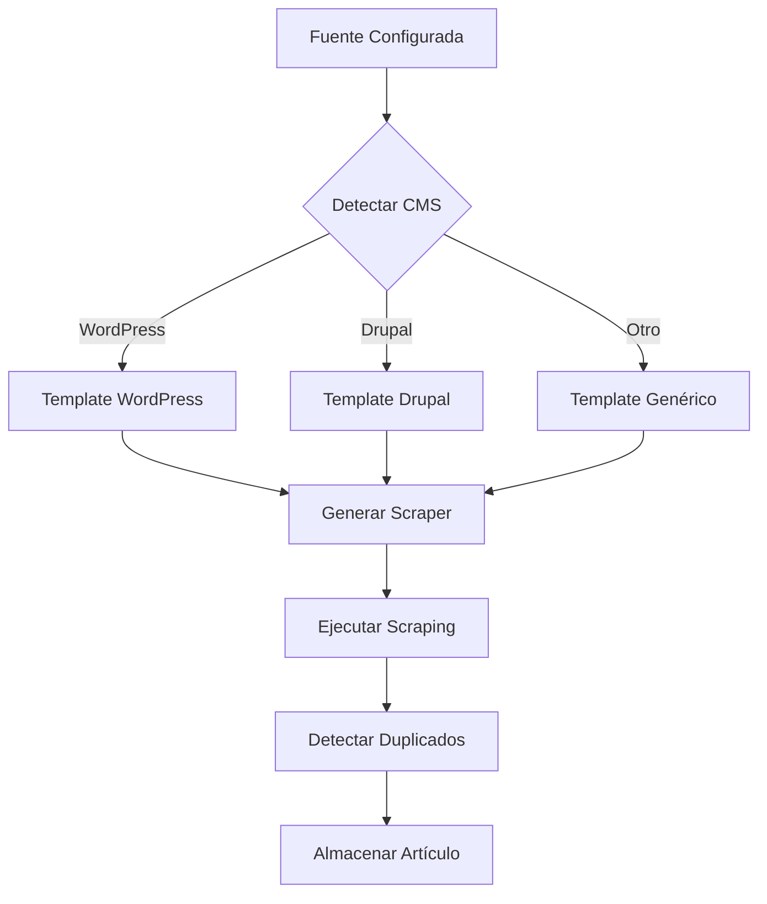
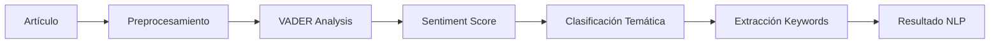
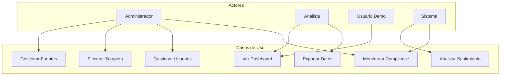
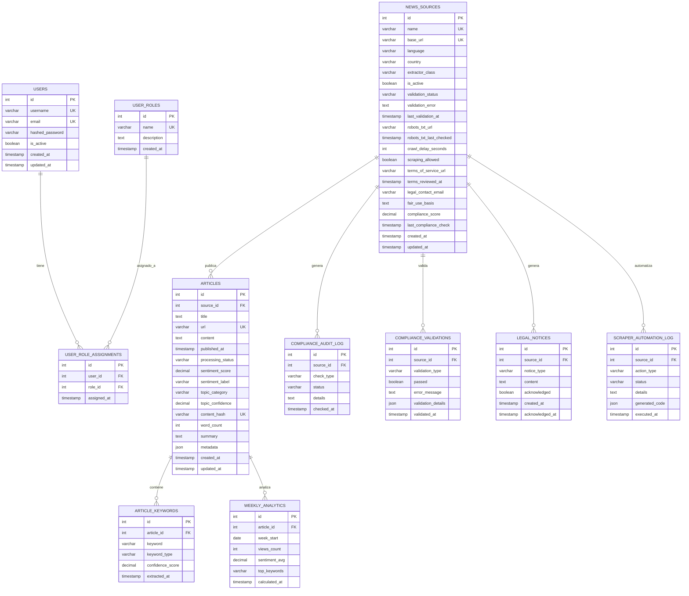
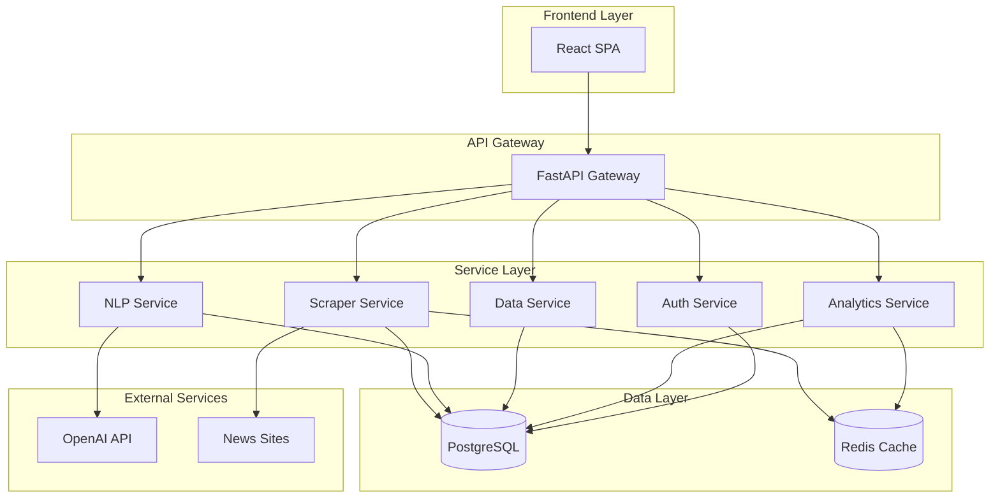
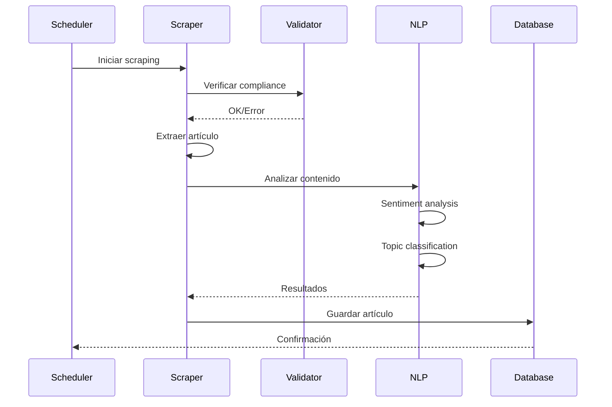

# 2. Diseño Técnico del Sistema de Información

## Índice del Contenido

1. [Esquema o Modelo de Requerimientos](#esquema-o-modelo-de-requerimientos)
2. [Software Base del Sistema y Prerequisitos](#software-base-del-sistema-y-prerequisitos)
3. [Componentes y Estándares](#componentes-y-estándares)
4. [Modelo de Datos](#modelo-de-datos)
5. [Funcionalidad y Servicios Ofrecidos](#funcionalidad-y-servicios-ofrecidos)

## Esquema o Modelo de Requerimientos

### Requerimientos Funcionales Principales

El sistema implementa los siguientes requerimientos funcionales críticos:

#### RF-001: Gestión de Fuentes de Noticias


**Criterios de Aceptación:**
- Compliance score calculado automáticamente (0.00 - 1.00)
- Crawl delay mínimo de 2 segundos
- Registro completo de auditoría
- Rechazo automático de fuentes no conformes

#### RF-002: Web Scraping Automatizado


#### RF-003: Análisis NLP


### Requerimientos No Funcionales

| Categoría | Requerimiento | Métrica |
|-----------|---------------|---------|
| **Rendimiento** | Procesamiento de artículos | 50+ artículos/minuto |
| **Rendimiento** | Tiempo de carga dashboard | < 3 segundos |
| **Rendimiento** | Respuesta API | < 2 segundos |
| **Rendimiento** | Pipeline completo | < 4 horas |
| **Disponibilidad** | Uptime en horario laboral | ≥ 95% |
| **Seguridad** | Autenticación | JWT con expiración 24h |
| **Seguridad** | Contraseñas | Hash bcrypt |
| **Escalabilidad** | Usuarios concurrentes | 20+ usuarios |
| **Mantenibilidad** | Cobertura de tests | ≥ 85% |

### Casos de Uso del Sistema



## Software Base del Sistema y Prerequisitos

### Requerimientos Mínimos de Hardware

| Componente | Desarrollo | Producción |
|------------|------------|------------|
| **CPU** | 2 cores | 4+ cores |
| **RAM** | 4 GB | 8+ GB |
| **Almacenamiento** | 20 GB SSD | 50+ GB SSD |
| **Red** | 10 Mbps | 100+ Mbps |

### Requerimientos de Software

#### Sistema Operativo
- **Desarrollo**: Windows 10+, macOS 10.15+, Ubuntu 20.04+
- **Producción**: Ubuntu 20.04 LTS o superior
- **Contenedores**: Docker 20.10+ y Docker Compose 2.0+

#### Runtime y Lenguajes
```yaml
Backend:
  - Python: 3.13.5 (específico)
  - pip: 24.3+

Frontend:
  - Node.js: 24.4.1
  - npm: 11.4.2

Base de Datos:
  - PostgreSQL: 16-alpine
  - Redis: 8-alpine
```

#### Navegadores Compatibles
- Chrome 90+
- Firefox 88+
- Safari 14+
- Edge 90+

## Componentes y Estándares

### Frameworks y Librerías Backend

```python
# Framework Principal
FastAPI==0.115.14          # Framework web asíncrono
uvicorn[standard]==0.34.0  # Servidor ASGI

# ORM y Base de Datos
SQLAlchemy==2.0.41        # ORM principal
asyncpg==0.30.0           # Driver PostgreSQL asíncrono
alembic==1.14.0           # Migraciones de BD

# NLP y Análisis
spacy==3.8.7              # Framework NLP
vaderSentiment==3.3.2     # Análisis de sentimiento

# Web Scraping
beautifulsoup4==4.13.4    # Parser HTML
playwright==1.51.0        # Automatización web

# Utilidades
pydantic==2.11.3          # Validación de datos
python-jose==3.5.0        # JWT tokens
passlib[bcrypt]==1.7.4    # Hashing de contraseñas
redis==5.2.1              # Cliente Redis
```

### Frameworks y Librerías Frontend

```json
{
  "frameworks": {
    "react": "19.1.0",
    "vite": "7.0.0",
    "typescript": "5.8.3"
  },
  "ui_components": {
    "@tailwindcss/forms": "0.5.10",
    "tailwindcss": "4.1.11",
    "lucide-react": "0.525.0",
    "@heroicons/react": "2.2.0"
  },
  "state_management": {
    "@tanstack/react-query": "5.81.5",
    "react-hook-form": "7.59.0"
  },
  "visualization": {
    "recharts": "3.0.2",
    "leaflet": "1.9.4",
    "react-leaflet": "5.0.0"
  }
}
```

### Estándares de Codificación

#### Python (Backend)
- **PEP 8**: Guía de estilo oficial de Python
- **Black**: Formateador automático (línea máx: 88 caracteres)
- **isort**: Ordenamiento de imports
- **flake8**: Linting y verificación de estilo

#### JavaScript/TypeScript (Frontend)
- **ESLint**: Linting con configuración estricta
- **Prettier**: Formateador de código
- **TypeScript**: Tipado estático estricto

### Patrones de Diseño Implementados

1. **Repository Pattern**: Capa de acceso a datos
2. **Dependency Injection**: Inyección de dependencias con FastAPI
3. **Factory Pattern**: Generación de scrapers
4. **Observer Pattern**: Sistema de eventos y notificaciones
5. **Singleton**: Conexiones a base de datos y cache

### Protocolos y Estándares

#### Seguridad
- **HTTPS**: TLS 1.2+ en producción
- **CORS**: Configuración restrictiva
- **Rate Limiting**: Límites por endpoint
- **Input Validation**: Pydantic models

#### APIs
- **REST**: Arquitectura RESTful
- **OpenAPI 3.0**: Documentación automática
- **JSON**: Formato de intercambio
- **UTF-8**: Codificación de caracteres

## Modelo de Datos

### Diagrama Entidad-Relación



### Diccionario de Datos

#### Tabla: news_sources
| Campo | Tipo | Descripción | Restricciones |
|-------|------|-------------|---------------|
| id | INTEGER | Identificador único | PK, AUTO_INCREMENT |
| name | VARCHAR(255) | Nombre de la fuente | NOT NULL, UNIQUE |
| base_url | VARCHAR(500) | URL base del sitio | NOT NULL, UNIQUE |
| language | VARCHAR(10) | Código ISO del idioma | NOT NULL |
| country | VARCHAR(100) | País de origen | NOT NULL |
| compliance_score | DECIMAL(3,2) | Score de cumplimiento | 0.00 - 1.00 |
| is_active | BOOLEAN | Estado activo/inactivo | DEFAULT TRUE |
| crawl_delay_seconds | INTEGER | Delay entre requests | MIN 2 |
| created_at | TIMESTAMP | Fecha de creación | NOT NULL |
| updated_at | TIMESTAMP | Última actualización | NOT NULL |

#### Tabla: articles
| Campo | Tipo | Descripción | Restricciones |
|-------|------|-------------|---------------|
| id | INTEGER | Identificador único | PK, AUTO_INCREMENT |
| source_id | INTEGER | ID de la fuente | FK → news_sources(id) |
| title | TEXT | Título del artículo | NOT NULL |
| url | VARCHAR(1000) | URL del artículo | NOT NULL, UNIQUE |
| content | TEXT | Contenido completo | NULL |
| published_at | TIMESTAMP | Fecha de publicación | NOT NULL |
| sentiment_score | DECIMAL(4,3) | Score de sentimiento | -1.000 a 1.000 |
| sentiment_label | VARCHAR(20) | Etiqueta sentimiento | ENUM: positive/negative/neutral |
| topic_category | VARCHAR(50) | Categoría temática | NOT NULL |
| content_hash | VARCHAR(64) | Hash SHA-256 | UNIQUE |
| word_count | INTEGER | Conteo de palabras | >= 0 |

### Índices de Base de Datos

```sql
-- Índices de rendimiento
CREATE INDEX idx_articles_source_id ON articles(source_id);
CREATE INDEX idx_articles_published_at ON articles(published_at DESC);
CREATE INDEX idx_articles_sentiment ON articles(sentiment_label, sentiment_score);
CREATE INDEX idx_articles_topic ON articles(topic_category);

-- Índices únicos
CREATE UNIQUE INDEX idx_sources_base_url ON news_sources(base_url);
CREATE UNIQUE INDEX idx_articles_url ON articles(url);
CREATE UNIQUE INDEX idx_articles_hash ON articles(content_hash);
```

## Funcionalidad y Servicios Ofrecidos

### Arquitectura de Servicios



### Endpoints API Principales

#### Autenticación
```http
POST   /api/auth/login      # Login de usuario
POST   /api/auth/refresh    # Renovar token
GET    /api/auth/me         # Usuario actual
```

#### Gestión de Fuentes
```http
GET    /api/sources         # Listar fuentes
POST   /api/sources         # Crear fuente
PUT    /api/sources/{id}    # Actualizar fuente
DELETE /api/sources/{id}    # Eliminar fuente
POST   /api/sources/{id}/validate  # Validar compliance
```

#### Artículos y Analytics
```http
GET    /api/articles        # Listar artículos con filtros
GET    /api/articles/{id}   # Detalle de artículo
GET    /api/analytics/summary      # Resumen estadístico
GET    /api/analytics/sentiment    # Distribución sentimiento
GET    /api/analytics/trends       # Tendencias temporales
```

#### Exportación
```http
POST   /api/export/csv      # Exportar a CSV
POST   /api/export/excel    # Exportar a Excel
POST   /api/export/pdf      # Exportar a PDF
POST   /api/export/chart    # Exportar gráfico PNG
```

### Flujos de Proceso Principales

#### Flujo de Scraping


### Servicios de Monitoreo

- **Health Check**: `/health` - Estado del sistema
- **Metrics**: Métricas de rendimiento internas
- **Logging**: Logs estructurados con niveles
- **Alertas**: Notificaciones de eventos críticos

---

*Siguiente: [03. Instalación y Configuración](03_InstalacionConfiguracion.md)*
