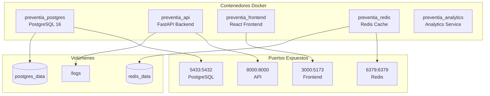

# 3. Instalación y Configuración del Sistema

## Índice del Contenido

1. [Pre-requisitos de Instalación](#pre-requisitos-de-instalación)
2. [Organización de Componentes](#organización-de-componentes)
3. [Instalación Paso a Paso](#instalación-paso-a-paso)
4. [Configuración del Sistema](#configuración-del-sistema)
5. [Scripts de Instalación](#scripts-de-instalación)
6. [Verificación de la Instalación](#verificación-de-la-instalación)

## Pre-requisitos de Instalación

### Requisitos del Sistema Operativo

#### Desarrollo
- **Windows**: Windows 10 versión 2004 o superior con WSL2
- **macOS**: macOS 10.15 Catalina o superior
- **Linux**: Ubuntu 20.04 LTS, Debian 11, o distribución equivalente

#### Producción (Recomendado)
- **Ubuntu Server**: 20.04 LTS o 22.04 LTS
- **Kernel**: Linux 5.4 o superior
- **Arquitectura**: x86_64 (AMD64)

### Software Requerido

```bash
# Verificar versiones instaladas
$ python --version  # Python 3.13.5
$ node --version    # v24.4.1
$ npm --version     # 11.4.2
$ docker --version  # Docker version 20.10+
$ docker-compose --version  # Docker Compose version 2.0+
```

### Instalación de Dependencias Base

#### Ubuntu/Debian
```bash
# Actualizar sistema
sudo apt update && sudo apt upgrade -y

# Instalar dependencias del sistema
sudo apt install -y \
    build-essential \
    curl \
    git \
    wget \
    software-properties-common \
    ca-certificates \
    gnupg \
    lsb-release

# Instalar Python 3.13
sudo add-apt-repository ppa:deadsnakes/ppa
sudo apt update
sudo apt install -y python3.13 python3.13-venv python3.13-dev

# Instalar Node.js 24.x
curl -fsSL https://deb.nodesource.com/setup_24.x | sudo -E bash -
sudo apt install -y nodejs

# Instalar Docker
curl -fsSL https://get.docker.com | sudo sh
sudo usermod -aG docker $USER
```

#### macOS
```bash
# Instalar Homebrew si no está instalado
/bin/bash -c "$(curl -fsSL https://raw.githubusercontent.com/Homebrew/install/HEAD/install.sh)"

# Instalar dependencias
brew install python@3.13 node@24 git docker docker-compose
```

## Organización de Componentes

### Estructura del Proyecto

```
news_bot_3/
├── services/               # Microservicios backend
│   ├── api/               # API REST principal
│   ├── scraper/           # Servicio de web scraping
│   ├── nlp/               # Servicio de análisis NLP
│   ├── data/              # Capa de acceso a datos
│   ├── orchestrator/      # Coordinador de pipeline
│   └── shared/            # Componentes compartidos
├── preventia-dashboard/    # Frontend React
│   ├── src/               # Código fuente
│   ├── public/            # Assets públicos
│   └── package.json       # Dependencias frontend
├── cli/                   # Herramientas CLI
├── scripts/               # Scripts de automatización
├── config/                # Archivos de configuración
├── tests/                 # Suite de pruebas
├── docker-compose.yml     # Orquestación de contenedores
├── requirements.txt       # Dependencias Python
└── .env.example          # Variables de entorno ejemplo
```

### Componentes del Sistema



## Instalación Paso a Paso

### Paso 1: Clonar el Repositorio

```bash
# Clonar el repositorio
git clone https://github.com/preventia/news_bot_3.git
cd news_bot_3

# Verificar la rama correcta
git checkout main
```

### Paso 2: Configurar Variables de Entorno

```bash
# Copiar archivo de ejemplo
cp .env.example .env

# Editar variables de entorno
nano .env
```

Configurar las siguientes variables críticas:

```env
# Base de Datos
POSTGRES_DB=preventia_news
POSTGRES_USER=preventia
POSTGRES_PASSWORD=<CAMBIAR_PASSWORD_SEGURO>
DATABASE_URL=postgresql://preventia:<PASSWORD>@localhost:5433/preventia_news

# API
API_HOST=0.0.0.0
API_PORT=8000
API_RELOAD=false
JWT_SECRET_KEY=<GENERAR_CLAVE_SEGURA>

# OpenAI (para análisis avanzado)
OPENAI_API_KEY=<TU_API_KEY>

# Configuración de Scraping
DAYS_INTERVAL=7
WEEKLY_DAY=Monday
WEEKLY_TIME=08:00
```

### Paso 3: Instalación con Docker (Recomendado)

```bash
# Construir y levantar todos los servicios
docker-compose up -d --build

# Verificar que todos los contenedores estén ejecutándose
docker-compose ps

# Ver logs en tiempo real
docker-compose logs -f
```

### Paso 4: Instalación Manual (Desarrollo)

#### Backend
```bash
# Crear entorno virtual Python
python3.13 -m venv venv
source venv/bin/activate  # En Windows: venv\Scripts\activate

# Instalar dependencias
pip install --upgrade pip
pip install -r requirements.txt

# Instalar modelos de Spacy
python -m spacy download en_core_web_sm
python -m spacy download es_core_news_sm

# Configurar base de datos
alembic upgrade head
```

#### Frontend
```bash
# Navegar al directorio frontend
cd preventia-dashboard

# Instalar dependencias
npm install

# Construir para producción
npm run build
```

### Paso 5: Inicialización de Base de Datos

```bash
# Opción 1: Usando Docker (recomendado)
docker-compose exec api python -m services.api.auth.startup

# Opción 2: Manualmente
cd services/data/database/migrations
psql -h localhost -p 5433 -U preventia -d preventia_news -f 001_initial_schema.sql
psql -h localhost -p 5433 -U preventia -d preventia_news -f 002_compliance_consolidated.sql
```

## Configuración del Sistema

### Configuración de PostgreSQL

```sql
-- Verificar conexión
\c preventia_news

-- Verificar tablas creadas
\dt

-- Configurar permisos
GRANT ALL PRIVILEGES ON DATABASE preventia_news TO preventia;
GRANT ALL PRIVILEGES ON ALL TABLES IN SCHEMA public TO preventia;
GRANT ALL PRIVILEGES ON ALL SEQUENCES IN SCHEMA public TO preventia;
```

### Configuración de Redis

```bash
# Archivo redis.conf personalizado (opcional)
maxmemory 256mb
maxmemory-policy allkeys-lru
save 900 1
save 300 10
save 60 10000
```

### Configuración de Nginx (Producción)

```nginx
server {
    listen 80;
    server_name preventia.example.com;

    # Redirección a HTTPS
    return 301 https://$server_name$request_uri;
}

server {
    listen 443 ssl http2;
    server_name preventia.example.com;

    ssl_certificate /path/to/cert.pem;
    ssl_certificate_key /path/to/key.pem;

    # Frontend
    location / {
        proxy_pass http://localhost:3000;
        proxy_http_version 1.1;
        proxy_set_header Upgrade $http_upgrade;
        proxy_set_header Connection 'upgrade';
        proxy_set_header Host $host;
        proxy_cache_bypass $http_upgrade;
    }

    # API Backend
    location /api {
        proxy_pass http://localhost:8000;
        proxy_http_version 1.1;
        proxy_set_header X-Real-IP $remote_addr;
        proxy_set_header X-Forwarded-For $proxy_add_x_forwarded_for;
        proxy_set_header Host $host;
    }
}
```

### Configuración de Perfiles y Roles

```python
# Roles predefinidos del sistema
SYSTEM_ROLES = {
    "admin": {
        "name": "Administrator",
        "permissions": ["all"],
        "description": "Full system access"
    },
    "analyst": {
        "name": "Analyst",
        "permissions": ["read", "export", "analytics"],
        "description": "Read and export data"
    },
    "demo": {
        "name": "Demo User",
        "permissions": ["read:limited"],
        "description": "Limited read access"
    }
}
```

## Scripts de Instalación

### Script de Instalación Completa

```bash
#!/bin/bash
# install.sh - Script de instalación automática

set -e

echo "🚀 Iniciando instalación de PreventIA News Analytics..."

# Verificar dependencias
command -v docker >/dev/null 2>&1 || { echo "❌ Docker no está instalado"; exit 1; }
command -v docker-compose >/dev/null 2>&1 || { echo "❌ Docker Compose no está instalado"; exit 1; }

# Configurar variables de entorno
if [ ! -f .env ]; then
    echo "📝 Creando archivo .env..."
    cp .env.example .env
    echo "⚠️  Por favor, edita el archivo .env con tus configuraciones"
    exit 1
fi

# Construir contenedores
echo "🔨 Construyendo contenedores Docker..."
docker-compose build

# Levantar servicios
echo "🔧 Levantando servicios..."
docker-compose up -d

# Esperar a que PostgreSQL esté listo
echo "⏳ Esperando a PostgreSQL..."
sleep 10

# Inicializar base de datos
echo "💾 Inicializando base de datos..."
docker-compose exec -T postgres psql -U preventia -d preventia_news < services/data/database/migrations/001_initial_schema.sql
docker-compose exec -T postgres psql -U preventia -d preventia_news < services/data/database/migrations/002_compliance_consolidated.sql

# Crear usuario admin
echo "👤 Creando usuario administrador..."
docker-compose exec api python -m services.api.auth.startup

echo "✅ Instalación completada exitosamente!"
echo "📊 Dashboard disponible en: http://localhost:3000"
echo "📚 API Docs disponibles en: http://localhost:8000/docs"
```

### Script de Carga Inicial de Datos

```python
#!/usr/bin/env python3
# init_data.py - Carga inicial de datos de ejemplo

import asyncio
from services.data.database.connection import DatabaseManager
from services.data.models import NewsSource

async def load_initial_sources():
    """Cargar fuentes de noticias iniciales"""
    db = DatabaseManager()
    await db.initialize()

    sources = [
        {
            "name": "El Tiempo - Salud",
            "base_url": "https://www.eltiempo.com/salud",
            "language": "es",
            "country": "Colombia",
            "crawl_delay_seconds": 3,
            "robots_txt_url": "https://www.eltiempo.com/robots.txt",
            "terms_of_service_url": "https://www.eltiempo.com/terminos",
            "legal_contact_email": "legal@eltiempo.com"
        },
        {
            "name": "Semana - Vida Moderna",
            "base_url": "https://www.semana.com/vida-moderna",
            "language": "es",
            "country": "Colombia",
            "crawl_delay_seconds": 3,
            "robots_txt_url": "https://www.semana.com/robots.txt",
            "terms_of_service_url": "https://www.semana.com/terminos",
            "legal_contact_email": "contacto@semana.com"
        }
    ]

    for source_data in sources:
        # Crear fuente si no existe
        existing = await db.execute_sql(
            "SELECT id FROM news_sources WHERE base_url = :url",
            {"url": source_data["base_url"]}
        )
        if not existing:
            await db.execute_sql(
                """INSERT INTO news_sources
                   (name, base_url, language, country, crawl_delay_seconds,
                    robots_txt_url, terms_of_service_url, legal_contact_email)
                   VALUES (:name, :base_url, :language, :country, :crawl_delay,
                          :robots_url, :terms_url, :legal_email)""",
                source_data
            )
            print(f"✅ Fuente creada: {source_data['name']}")

    await db.close()

if __name__ == "__main__":
    asyncio.run(load_initial_sources())
```

## Verificación de la Instalación

### Verificar Servicios Docker

```bash
# Estado de contenedores
docker-compose ps

# Resultado esperado:
# NAME                  STATUS              PORTS
# preventia_postgres    Up (healthy)        0.0.0.0:5433->5432/tcp
# preventia_api         Up (healthy)        0.0.0.0:8000->8000/tcp
# preventia_frontend    Up (healthy)        0.0.0.0:3000->5173/tcp
# preventia_redis       Up                  0.0.0.0:6379->6379/tcp
# preventia_analytics   Up
```

### Verificar Endpoints

```bash
# Health check del API
curl http://localhost:8000/health

# Respuesta esperada:
# {
#   "status": "healthy",
#   "database": "connected",
#   "articles_count": 0,
#   "version": "1.0.0"
# }

# Frontend
curl -I http://localhost:3000

# Documentación API
open http://localhost:8000/docs
```

### Verificar Base de Datos

```bash
# Conectar a PostgreSQL
docker-compose exec postgres psql -U preventia -d preventia_news

# Verificar tablas
\dt

# Verificar usuario admin
SELECT username, email, is_active FROM users WHERE username = 'admin';
```

### Logs y Diagnóstico

```bash
# Ver todos los logs
docker-compose logs

# Logs de un servicio específico
docker-compose logs -f api

# Logs con timestamps
docker-compose logs -t --tail=100 api
```

### Prueba Funcional Rápida

```bash
# Login como admin
curl -X POST http://localhost:8000/api/auth/login \
  -H "Content-Type: application/x-www-form-urlencoded" \
  -d "username=admin&password=admin123"

# Usar el token retornado para consultas autenticadas
TOKEN="<token_retornado>"

# Listar fuentes
curl -H "Authorization: Bearer $TOKEN" \
  http://localhost:8000/api/sources
```

---

*Siguiente: [04. Despliegue](04_Despliegue.md)*
